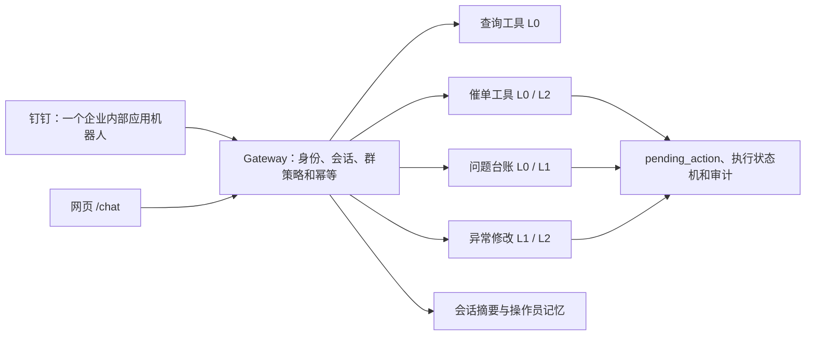

# 会话管理与钉钉机器人方案

> **归档。** 现行说明见 [`../../架构.md`](../../架构.md)。

> 状态：与当前代码对齐（S1/S2/S5 已落地；多群路由仍后置）  
> 更新日期：2026-08-18  
> 适用范围：采购助手 Agent、网页 `/chat`、钉钉 Stream 机器人、催单、问题收集和异常订单处理

## 1. 结论

钉钉侧采用 **一个企业内部应用机器人、多个使用入口和策略域**，不按“催单、查询、问题收集、异常修改”分别复制机器人。

推荐第一阶段使用：

1. 机器人私聊：员工只收催办和任务确认/取消；管理员私聊可用全部能力，并审批绑定。
2. 采购协同/交期群：查询、换鞋垫、品控、绑定申请；定时催单、交期预警和日报。
3. 异常订单处置群：换货 dry-run、异常范围核对和受控执行，仅允许指定成员使用。
4. 当品控消息量或参与人员与采购协同群明显不同时，再拆出独立品控问题群。

群可以有多个，机器人通常只保留一个。后台由同一个 Gateway 根据企业、群、用户、会话和风险级别路由到不同工具与工作流。仅在内外部数据边界、钉钉企业、应用凭证或服务权限需要物理隔离时，才增加第二个机器人。

## 2. 核心概念

会话、上下文、记忆、业务状态和审计必须分开管理：

| 层次 | 含义 | 本项目的存储与使用方式 |
|---|---|---|
| 会话 Session | 哪些连续消息属于同一个话题 | `agent_sessions` + `agent_messages`，按渠道和会话键隔离，并通过 epoch 翻篇 |
| 当前上下文 Context | 本次请求实际发送给模型的内容 | 系统规则、权限、操作员记忆、会话摘要、最近消息、当前业务对象和工具结果，受字符或 token 预算限制 |
| 长期记忆 Memory | 跨会话仍值得保留的少量稳定信息 | 仅保存已绑定采购员的偏好、职责、称呼和稳定约定；有数量上限并支持“忘记” |
| 业务状态 | 问题、催办、换货和审批的真实进度 | 独立业务表及确定性状态机，不从聊天记录推断 |
| 审计 Audit | 事后追查需要的完整事实 | 完整消息、模型运行、工具调用、确认、执行和通知投递记录；不自动全部注入模型 |

业务数字不进入长期记忆。金额、数量、交期、待入库量、订单状态等必须在使用时重新调用确定性工具查询，避免把历史数字误当成当前事实。

## 3. Hermes Agent 调研结果

Hermes Agent 的设计可以概括为“单 Gateway、多会话域、分层上下文、受控长期记忆和按需历史检索”。

### 3.1 会话

- 每个聊天来源通过 per-chat session store 建立独立会话。
- 会话和消息持久化到 SQLite，服务重启后仍可恢复。
- 会话默认持续存在，用户可以通过 `/new`、`/reset` 开新话题，通过 `/sessions`、`/resume` 查找或恢复历史会话。
- 可配置按空闲时间或每日固定时间自动重置。
- 模型切换等会话属性随会话持久化，而不是只存在进程内。
- 最终回复使用持久化投递台账，服务在发送前后崩溃时可以恢复投递，并明确提示可能重复，语义为有界的 at-least-once。

### 3.2 当前上下文

Hermes 不把所有历史消息无条件发送给模型，而是分层组装：

1. 全局身份和系统规则。
2. 项目上下文文件，例如 `AGENTS.md`。
3. 有界的用户与 Agent 记忆快照。
4. 当前会话的摘要和近期消息。
5. 当前轮需要的工具定义、工具结果和业务信息。

上下文文件会按工作目录逐级发现，更具体的规则后加载并具有更高优先级。会话过长时支持 `/compress`，后台会保留会话记录，但只把摘要和近期消息放入当前模型上下文。

### 3.3 长期记忆

Hermes 内置两份有严格上限的精选记忆：

| 文件 | 用途 | 当前文档默认限制 |
|---|---|---|
| `MEMORY.md` | 环境事实、项目约定、经验和稳定工作习惯 | 2,200 字符 |
| `USER.md` | 用户身份、表达偏好和期望 | 1,375 字符 |

记忆在会话开始时作为冻结快照注入系统提示。会话中新增或修改记忆会立即持久化，但从下一次会话起才进入系统提示，以保持提示前缀稳定。

记忆工具只提供新增、替换和删除；容量不足时要求 Agent 主动合并或删除旧条目，不静默丢弃。Hermes 还支持：

- 对记忆写入设置审批开关；
- 对记忆内容做注入和外泄模式扫描；
- 使用 SQLite FTS5 按需搜索全部历史会话；
- 把稳定操作方法沉淀为 Skill，作为程序性记忆；
- 通过外部 provider 扩展语义搜索、知识图谱或用户建模，但不替代内置的小型精选记忆。

本项目不需要为了实现第一版记忆而引入向量库。结构化操作员记忆、会话摘要和业务表已经能覆盖当前采购场景。

### 3.4 多渠道和多群

Hermes 使用一个 Gateway 同时连接多个消息平台。每个平台 adapter 接收入站消息，映射到 per-chat session，再交给同一个 Agent Core。不同频道可以覆盖模型、provider 和 system prompt；用户的会话级设置优先于频道默认值。

这一设计说明：功能拆分应发生在 Gateway 后面的策略、权限、工具和业务状态层，而不是通过复制多个机器人进程完成。

Hermes 还明确提醒，两个 Agent 进程不应直接共享同一份文件记忆目录，否则并发自动写入会产生彼此未授权的混合状态。本项目若以后横向扩容，应使用数据库事务、版本号或单写者机制管理记忆，不能让多个进程并发改同一份 Markdown 记忆文件。

## 4. 目标架构



Gateway 负责：

- 钉钉或网页身份解析；
- 会话键计算、会话锁和忙时消息队列；
- 群策略、工具白名单和结果可见范围；
- 入站消息去重和出站投递记录；
- L1/L2 待确认动作的渲染与回调；
- 把请求路由到同一个 Agent Core 和确定性业务工具。

模型只负责理解意图、补齐参数、选择工具和组织话术。业务查询、计算、文件生成、问题登记、外发和 ERP 修改都由确定性代码完成。

## 5. 会话隔离规则

### 5.1 会话键

当前钉钉实现使用 `conversation_id:sender_id`，能够避免同一群内不同员工串线，应继续保留这一原则。

推荐的逻辑键为：

```text
tenant_id + channel + conversation_id + sender_id + epoch
```

- `tenant_id`：钉钉企业或部署租户，当前单企业可先使用固定值。
- `channel`：`web`、`dingtalk` 等渠道。
- `conversation_id`：私聊或群会话 ID。
- `sender_id`：钉钉 userId；网页侧来自 `webToken` 会话里的已绑定 sender_id，不是客户端自报姓名。
- `epoch`：同一来源下的当前话题编号。

数据库唯一键仍可保持 `(channel, session_key)`；上述字段可以编码进 `session_key`，也可以在后续迁移时拆列，便于权限查询和统计。

### 5.2 为什么不使用纯群共享会话

采购群中的多人消息如果共用一段模型历史，会产生：

- 不同员工的指代和权限相互污染；
- 私人查询结果可能被带入群回复；
- 一人正在补参数时，另一人的问题打断原任务；
- 群消息越多，上下文越快膨胀。

多人协作不应依赖共享聊天记忆，而应依赖共享业务对象，例如：

- `quality_issue_id`：问题登记、补充和关闭；
- `exchange_job_id`：换货 dry-run 和执行进度；
- `pending_action_id`：待确认动作；
- `po_id` / `o_id`：采购单或销售订单。

群成员通过明确编号继续处理同一个业务对象，Agent 每次从业务库读取最新状态。

### 5.3 生命周期

采用 epoch 机制管理新话题：

- 空闲超过 `AGENT_SESSION_IDLE_MINUTES` 时自动 `epoch += 1`；建议默认 120 分钟。
- 钉钉支持“新话题”“重置会话”，网页“清空会话”改成递增 epoch，不删除审计记录。
- 当前上下文只读取当前 epoch；历史页面仍可展示全部 epoch。
- `pending_actions`、问题单和换货任务不随会话重置删除，它们有自己的生命周期。
- 服务需要对同一 session 串行处理或排队，防止两条并发消息同时基于旧上下文执行。

## 6. 上下文组装与压缩

每次模型调用按以下顺序组装上下文：

```text
1. 系统提示、日期和确定性业务规则
2. 当前渠道、群策略、调用人身份和可用工具
3. 已绑定操作员最近的精选记忆，总长不超过 500 字
4. 当前 epoch 最近一条滚动摘要，不超过 800 字
5. 最近 user / assistant 消息，按字符或 token 预算从新到旧装入
6. 当前业务对象的结构化快照
7. 当前轮工具结果
```

建议配置：

```bash
AGENT_CONTEXT_CHAR_BUDGET=60000
AGENT_TOOL_RESULT_LIMIT=8000
AGENT_SUMMARY_ENABLED=false
AGENT_SUMMARY_TRIGGER_MESSAGES=40
```

第一阶段先实施确定性的字符预算和工具结果信封。2026-08-18 对照现网场景后维持默认关：鞋垫、催办、合同、品控都是短闭环，工作集已经持有当前单号；摘要去掉金额/数量/日期后几乎只剩「查过某单、待确认」，对回答没有增量。只有以后出现很长的开放分析对话才值得开；即便开启，动态数字仍必须重查工具，且不宜继续以 system 角色注入。

压缩规则：

- 当前轮工具结果保留结构化全文，但受单条上限限制。
- 旧轮次工具结果只保留短预览，并明确标记需要重新查询。
- 截断后仍必须是合法 JSON，不能直接对 JSON 字符串切片。
- 摘要只保留单号、SKU、供应商、已确认结论和未完成事项。
- 金额、数量、日期、交期和状态等易变化数据不写入摘要或长期记忆。
- 完整原始消息和工具调用继续保存在审计库，压缩只影响模型输入。

## 7. 操作员记忆

第一阶段只做绑定员工维度的记忆，不做自由文本的全局业务记忆。

建议表结构沿用《完善方案v3-整改与Agent演进》中的 `operator_memories`：

- `operator`：绑定后的采购员身份；
- `kind`：`preference` 或 `context`；
- `content`：单条不超过 120 字；
- `source`：`explicit` 或 `summary`；
- `active`：用于软删除和审计。

行为规则：

- “记住……”显式写入并回显；“忘记……”停用匹配条目。
- 只有已绑定员工允许积累和读取记忆，匿名昵称不积累。
- 每位员工最多 20 条，模型每次只注入最近 5 条，总长不超过 500 字。
- 自动提炼的候选记忆默认关闭；启用后应支持待审批写入。
- 记忆进入提示前做长度、控制字符、隐藏 Unicode 和注入模式检查。
- 项目规则、风险分级、供应商映射和业务口径属于代码、配置或文档，不允许由模型自由写入记忆覆盖。

## 8. 钉钉群与机器人方案

### 8.1 推荐群布局

| 入口 | 用途 | 允许动作 | 不允许动作 |
|---|---|---|---|
| 机器人私聊（员工） | 催办投递、任务确认/取消 | 确认或取消自己的 pending | 查询、换鞋垫、品控、开放对话、当场绑定 |
| 机器人私聊（管理员） | 全部能力 + 绑定审批 | L0–L2；回「同意绑定 / 确认绑定」同意绑定（有待办时裸「确认」先执行待办）；群里 @ 申请人 | 未确认的 ERP 修改 |
| 采购协同/交期群 | 催单、交期预警、共享查询、问题登记、日报、绑定申请 | L0 查询；确定性登记；受控外发；提交绑定 | 直接修改 ERP；员工私聊里的完整对话 |
| 异常订单处置群 | 异常范围、换货 dry-run、执行确认和结果通知 | 指定成员的 L1/L2 | 未绑定用户写操作、模糊范围执行 |
| 可选品控问题群 | 品控登记、关闭、查询和日报 | 问题台账相关工具 | 采购合同、换货及其它 ERP 修改 |

查询通常不需要独立群。可能包含单价、供应商或个人负责范围的查询默认在私聊完成；群内查询按群策略返回适合共享的结果。

### 8.2 单机器人多群路由

企业内部应用机器人收到消息时会带会话 ID，当前代码已经按入站 `conversation_id` 回复。因此同一机器人可以服务多个群。

主动催单当前仅配置一个 `group_conversation_id`，后续应改为路由表，而不是新增机器人：

```text
scene / department / buyer
    -> openConversationId
    -> allowed_tools
    -> result_visibility
    -> template
    -> mention_policy
```

建议新增配置或业务表 `dingtalk_routes`，至少包含：

- `route_key`：如 `delivery`、`quality`、`exchange`；
- `conversation_id`；
- `enabled`；
- `allowed_tools`；
- `allowed_user_ids` 或成员策略；
- `message_template`；
- `updated_by`、`updated_at`。

### 8.3 何时拆第二个机器人

仅在以下场景拆分：

1. 供应商外部群和内部采购群需要隔离。
2. 使用不同钉钉企业或不同应用凭证。
3. 只读机器人和可写机器人需要独立服务账号、网络和数据库权限。
4. 不同业务具有独立 SLA、限流或故障域。

多个头像或机器人名称不构成安全隔离。若后台仍共享同一应用密钥、工具权限和数据库账号，拆机器人只会增加配置、运维和会话碎片。

## 9. 四类业务的处理方式

### 9.1 催单

- 定时清单由确定性代码生成，不经 LLM 计算数字。
- 自动推送使用固定场景路由到采购协同/交期群，并 @ 对应采购员。
- 手动触发外发属于 L2：预览目标群、采购单数量和 @ 人员，发起人确认后发送。
- 入站消息、发送动作和平台响应都记录幂等键及审计结果。

### 9.2 查询

- 通过固定参数化 L0 工具查询镜像库，禁止模型生成 SQL。
- 私聊可返回个人负责范围和完整明细；群内结果按策略限制敏感字段和行数。
- 大结果返回摘要和页面链接，不能把全量明细塞入聊天上下文。
- 后续追问中的动态数字必须重新查询，不能从摘要或长期记忆读取。

### 9.3 问题收集

- 明确格式，例如“品控 供应商 单号 描述”，走正则或确定性解析，直接登记并回显编号。
- 自然语言“帮我记一下……”由模型抽取字段时走 L1 preview，确认后写入。
- 问题记录保存原话、结构化字段、报告人、群、消息 ID 和状态。
- 同一 `message_id` 唯一，Stream 重投不重复登记。
- 查询、撤销、关闭和日报读取问题台账，不依赖聊天上下文。
- 当天汇总和 Excel 发送到来源群或配置的品控群。

### 9.4 异常单修改

- 对话只负责收集明确的订单、源 SKU、目标 SKU 和规则类型。
- 先查询候选订单，再生成 dry-run，不允许模型自行扩展订单范围。
- dry-run 登记属于 L1；真实 ERP 修改属于 L2，必须展示逐单变更清单。
- 保留当前“发起人本人确认 + 换货页二次确认 + worker 幂等执行”的安全边界。
- 跨款、白名单外替换或大批量修改以后可增加第二审批人，不通过普通群消息中的一句“同意”放行。

### 9.5 ERP 异常订单与“换单”分类（实页核验）

2026-08-14 使用已登录聚水潭 ERP 订单页做了只读核验。异常筛选表单的真实条件为：

```text
name=status
value=question
```

页面把该状态显示为“异常”，供应链 API 和本地镜像中的标准化值为 `Question`。因此 Agent 判断异常订单时应对大小写做归一化，不能根据页面中文字或异常说明模糊匹配：

```text
is_abnormal := lower(status) == "question"
```

用户首次打开页面时看到 941 条，核验过程中先后显示 939 条；“等待售后收货”也从 28 条变成 29 条，“线上换了商品”从 1 条变成 2 条。这些都是实时变化的业务数字，只用于说明当时页面状态，不能写入长期记忆、摘要或配置。每次问“现在有多少异常”都必须重新查询。

ERP 异常子类由 `question_type` 表示，说明由 `question_desc` 表示。换单相关字段至少包括：

| 字段 | 用途 |
|---|---|
| `status` | 总池判断；`Question` 表示当前异常 |
| `question_type` | 异常子类，如“线上换了商品”“缺货”“淘汰品”“等待售后收货” |
| `question_desc` | 异常原因补充，不能单独作为稳定枚举 |
| `type` | 订单类型；`换货订单` 表示已经生成的换货单 |
| `link_o_id` | 换货单关联的原订单 |
| `as_id` / `outer_as_id` | 售后单及外部售后单关联 |
| `items` / `skus` | 当前订单 SKU、数量及规格，用于生成换单 dry-run |

必须区分“已经生成的换货订单”和“仍需 Agent 换商品的异常订单”：

| Agent 分类 | 确定性条件 | 处置方式 |
|---|---|---|
| `existing_exchange_order` | `status=Question` 且 `type` 包含“换货订单” | 已进入换货生命周期；查询、跟踪或催办，不再次创建换单任务 |
| `exchange_candidate_high` | `status=Question`、不是换货订单且 `question_type=线上换了商品` | 高置信待换单；读取当前 SKU 和线上变更结果，生成逐单 dry-run |
| `exchange_candidate_stock` | `status=Question`、不是换货订单且 `question_type in (缺货, 淘汰品)` | 库存替换候选；必须先取得目标 SKU 或命中已审批白名单 |
| `manual_review` | `status=Question` 且 `question_type=修改订单` | 泛化人工修改队列，不自动等同换单，先读取说明、标签和 SKU 差异 |
| `other_abnormal` | 其它 `status=Question` | 按退款、锁定、在途、编码缺失等异常工作流处理 |

实页证据如下：

- “线上换了商品”的订单状态说明为“线上换商品，线下自动终止发货”，订单操作记录依次出现线上换商品、终止发货和标记异常，且详情显示当前订单暂无售后信息。这是当前最直接的待换单信号，不是已经生成的换货单。
- “修改订单”当前有 2 条，样本分别带有打印后转异常/定制款、储值卡支付等标签，说明它是泛化修改类，不能直接作为换单条件。
- “等待售后收货”显示“尚未完全收到退货”。本地镜像样本中该子类均为 `type=换货订单`，并带 `link_o_id` 和 `as_id`，应归为已有换货单的履约状态。
- “缺货”和“淘汰品”可以触发替换需求，但仅凭异常类型无法确定目标 SKU，不能直接执行 ERP 修改。

本地镜像只覆盖近期增量窗口，不等于 ERP 全量异常池。核验时镜像有 14,694 张近期订单，其中 92 张为 `Question`；16 张为 `换货订单`，均带 `link_o_id` 和 `as_id`。92 张中只有 1 张“缺货”和 2 张“淘汰品”，而 ERP 实页同时显示 8 张“缺货”和 27 张“淘汰品”，因此页面的 939/941 与镜像的 92 不矛盾。

实现时应把 `question_type`、`question_desc`、`type`、`link_o_id`、`as_id` 从 `source_payload` 提升为可查询字段，或使用受控的 JSON 投影；当前订单候选工具只有 `query/source_sku/limit`，不足以表达上述分类。供应链 `orders/search` 虽支持 `status` 参数，但文档注明其订单范围不包含淘系和拼多多订单，不能单独作为 ERP 全量异常池。Agent 工具至少应新增 `status`、`abnormal_class`、`question_types` 和 `exclude_existing_exchange` 参数，并继续禁止模型生成任意 SQL。

## 10. 当前实现评估

已经具备：

- `backend/dingtalk/stream.py` 按 `conversationId + senderId` 隔离会话。
- 钉钉 `message_id` 入站去重。
- 网页和钉钉共用 `agent_sessions` / `agent_messages`。
- L1/L2 使用 `pending_actions`，具备超时、取消、确认、幂等执行和审计。
- 绑定后的钉钉 userId 与采购员身份用于写操作确认。
- 催单计算、查询、合同、换货和通知均为确定性工具。

尚需实施：

1. ~~会话 epoch、空闲翻篇、显式重置、悬空 `tool_calls` 剔除。~~ **已做**。
2. ~~上下文预算、工具信封、旧工具结果压缩。~~ **已做**。
3. ~~同会话串行锁。~~ **已做**；忙时回「上一条还在处理」。
4. ~~token 使用量写入 `agent_runs`。~~ **已做**。滚动摘要默认关；落库前消毒金额/数量/日期。
5. ~~绑定操作员的小型长期记忆及“忘记”。~~ **已做**（`user_id`、注入扫描；`AGENT_MEMORY_ENABLED` 默认关）。网页与钉钉同一套指令。
6. 主动消息从单一 `group_conversation_id` 升级为多群路由（S4）。
7. ~~问题台账及每日汇总。~~ **已做**（品控登记 / 日报）。
8. ~~出站回复持久化投递台账。~~ **已做**（`outbox_messages` + JobWorker）。

## 11. 实施顺序

1. ~~**S1 会话安全**~~ **已做**。
2. ~~**S2 上下文预算**~~ **已做**。
3. **多群路由**：把固定目标群改成场景路由表；先上线采购协同群和异常处置群（S4）。
4. ~~**问题台账**~~ **已做**（品控）。
5. ~~**记忆**~~ **已做**（显式记住/忘记、绑定注入、扫描；默认关）。
6. **滚动摘要**：消毒已做，仍默认关；有真实 token 数据后再灰度开启。
7. **增强审批**：业务量上升后，再为跨款或大批量异常修改增加第二审批人。

不要在 S1/S2 尚未完成时通过增加多个机器人规避上下文问题；那会把相同问题复制到多个入口，并增加记忆一致性和权限维护成本。

## 12. 验收要点

- 同一群内两名员工交替提问，彼此上下文不串线。
- 空闲超过阈值后“上一个”“那张单”等指代不会错误继承昨天的话题。
- 重置会话后聊天上下文清空，但审计、问题单、换货任务和待确认动作仍可追踪。
- 超长工具结果不会产生非法 JSON，也不会让下一轮请求超过模型上下文。
- 群内查询不会泄露仅应在私聊可见的数据。
- 同一钉钉消息重复投递不会重复登记问题或重复发起动作。
- L1/L2 未确认前不会产生文件外发、通知或 ERP 修改。
- 同一机器人在多个群中使用不同工具白名单和目标路由。
- 服务在生成回复后、平台发送前重启时，回复可恢复投递且不会重新执行工具。
- “忘记”后对应操作员记忆不再进入新会话上下文。

## 13. 参考资料

- [Hermes Agent README](https://github.com/NousResearch/hermes-agent)
- [Hermes Persistent Memory](https://hermes-agent.nousresearch.com/docs/user-guide/features/memory)
- [Hermes Context Files](https://hermes-agent.nousresearch.com/docs/user-guide/features/context-files)
- [Hermes Messaging Gateway](https://hermes-agent.nousresearch.com/docs/user-guide/messaging)
- [钉钉开放平台：配置 Stream 推送](https://open.dingtalk.com/document/development/stream)
- 本仓库 `docs/architecture/Agent.md`
- 本仓库 `docs/完善方案v3-整改与Agent演进.md`
- 本仓库 `backend/agent/sessions.py`
- 本仓库 `backend/agent/actions.py`
- 本仓库 `backend/dingtalk/stream.py`
- 本仓库 `backend/dingtalk/sender.py`
