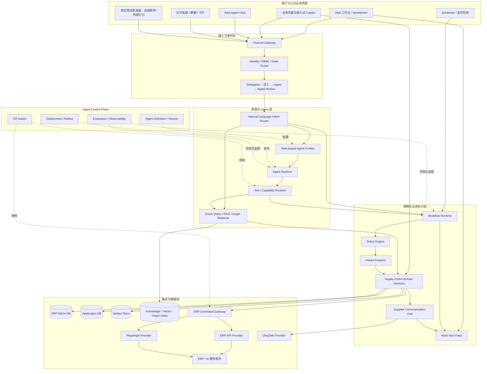
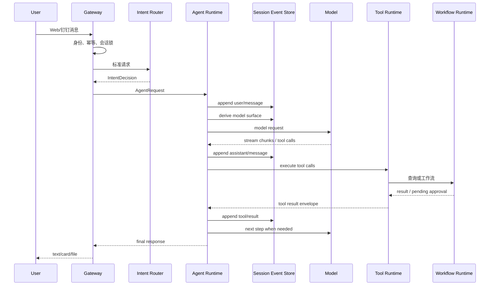
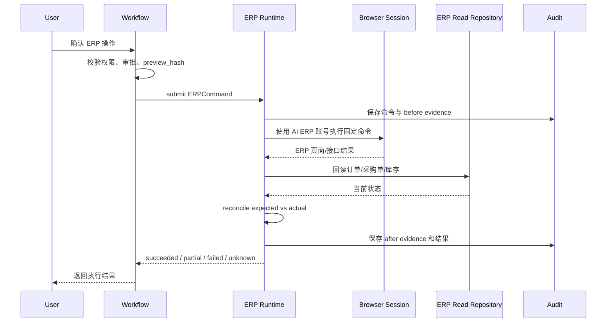
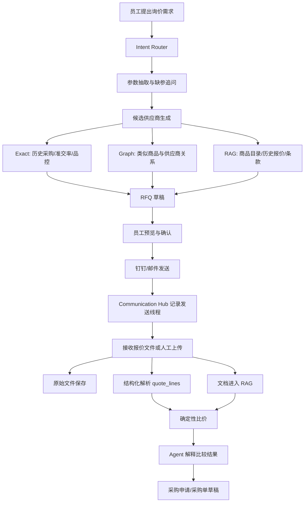

# 供应链 ERP Agent 平台详细架构设计方案（V5 评审稿）

> **文档状态**：目标架构 / 市场调研修订 / 技术评审稿 / Vibe Coding 执行基线  
> **更新日期**：2026-08-16  
> **适用范围**：采购供应链 WebUI、钉钉机器人、Agent Runtime、ERP 自动化、订单与采购业务、RAG/GraphRAG、询报价、预测、跟单、财务统计  
> **评审说明**：本文区分“当前已实现”“下一阶段必须建设”“中长期预留”，不代表所有目标能力已经落地。  
> **实施原则**：保留现有可用功能，采用增量演进，不进行一次性重写。

---

## 0. 文档定位与决策覆盖关系

本方案以当前项目已有实现和现有设计文档为基线，形成下一阶段统一目标架构。

### 0.1 继续保留并强化的核心原则

1. **薄 Agent + 确定性业务工具**：LLM 负责理解意图、补齐参数、选择能力和组织回答；查询、计算、文件生成、权限判断、ERP 写入和通知发送由普通代码完成。
2. **页面和定时任务不强制经过 LLM**：看板、台账、导出、定时催单、定时采退等明确流程直接调用应用服务。
3. **实时业务数字不依赖 RAG**：订单、库存、采购单、付款、交期、利润等当前事实必须查询结构化数据源。
4. **高风险操作必须经过“影响分析 → 预览 → 审批 → 执行 → 回读核验”**，并具备幂等、证据和异常恢复。
5. **不开放任意 SQL、Shell、JavaScript 或通用电脑操作能力给模型**；浏览器自动化只是 ERP 命令的受控 Provider。
6. **不支持 Agent 自主创建 Skill，不支持 Agent 自主修改长期记忆**；长期记忆只能显式写入或经确认写入。
7. **员工身份、Agent 身份和 ERP 数字员工身份彼此独立**，权限取三者与渠道、工作流策略的交集。
8. **Agent 是受治理的软件资产**：Prompt、模型、工具白名单、权限、评测集和发布版本必须可追踪、可回滚。
9. **聊天不是唯一工作界面**：需要处理、审批和异常恢复的任务进入 Web 工作任务中心，钉钉负责通知与轻交互。
10. **第一阶段采用共享运行时上的角色型 Agent Profile**，不引入多 Agent 自主协作和 A2A 网络。

### 0.2 本方案对旧约束的调整

以下旧约束由本方案替代：

| 旧约束 | 新决策 |
|---|---|
| 服务端不持有 ERP 登录态 | 后端可以使用专用 AI ERP 账号；第一阶段凭证可从 `.env` 加载，禁止提交代码仓库 |
| ERP 写入依赖员工浏览器中的 JS Worker | 改为后端 `ERP Automation Runtime`，使用专用账号执行固定、类型化命令 |
| Agent 不允许创建采购单 | 允许创建采购申请、采购单草稿和正式采购单，但必须经过权限、预览、确认、幂等和回读核验 |
| 明确不做 RAG | 调整为：实时 ERP 数字不做 RAG；制度、SOP、商品目录、历史报价、供应商资料和合同条款允许做受权限控制的 RAG |
| Web 共享 Token 代表操作员 | Web 和钉钉统一绑定到同一 `user_id`；共享 Token 仅作为传输鉴权，不作为用户身份 |
| 单进程 + SQLite 作为长期形态 | 第一阶段继续优化使用；目标形态为同仓库、同业务代码、多职责进程，应用库迁移至 MySQL/PostgreSQL |
| 单一采购助手且配置散落在代码中 | 改为共享 Agent Runtime 上的角色型 `Agent Profile`，由轻量 Agent Control Plane 管理版本、模型、工具和发布状态 |
| 只有员工身份与 ERP 登录账号 | 增加 Agent Identity、Digital Worker 和 Delegation，形成员工—Agent—ERP 服务账号三重留痕 |
| 写操作只做预览和确认 | 在预览前增加确定性 `Impact Analysis`，分析库存、履约、金额、重复操作和下游影响 |
| 对话回复是主要任务承载方式 | 增加 `Work Item Feed / 工作任务中心`，承载待确认、待审批、ERP 执行中、异常和供应商回复 |
| 钉钉发送能力按功能零散实现 | 增加 `Supplier Communication Hub`，统一消息线程、附件、业务对象关联、投递状态和回复解析 |

### 0.3 市场调研带来的架构修订

本次修订参考了 Microsoft Dynamics 365、IFS、Epicor、Oracle Fusion、SAP、Workday、UiPath，以及国内金蝶、用友等公开 ERP Agent 设计。本文只提炼公开资料中反复出现的架构模式，不假定这些产品与本项目的具体能力完全等价。

| 市场收敛模式 | 本项目采纳方式 | 第一阶段不照搬的部分 |
|---|---|---|
| **角色型业务 Agent**：采购、订单、对账、供应商沟通分别有明确职责 | 使用 `Agent Profile` 限定 Prompt、模型、工具、数据范围和风险策略 | 不启动多个独立 Agent 进程，不做多 Agent 自主协作 |
| **Agent Control Plane**：Agent 作为可版本化、可发布、可评测资产 | 建立 Agent 定义、版本、部署、评测和 Kill Switch | 第一版不做复杂低代码 Studio，只做配置表、管理 API 和最小管理页 |
| **Business Object / Action Tool**：按业务对象暴露查询与写入能力 | 使用类型化 Tool 和 ERP Command，增加字段级读写白名单 | 不动态暴露 ERP 全部表单、控件和方法，不允许任意 CRUD |
| **Digital Worker / Agent Identity**：数字员工有身份、权限、归属和审计 | 建立 `digital_workers`、`delegations`、`permission_decisions` | 不把一个高权限 ERP 账号直接等同于所有员工权限 |
| **Agent + Robot + Human**：模型判断、自动化执行、人员治理 | Agent 负责意图与解释，Playwright/API Provider 负责执行，工作流负责审批与恢复 | 不让模型自由浏览 ERP 或生成页面脚本 |
| **供应商沟通闭环**：催确认、回复抽取、采购单变化和询报价进入统一线程 | 建立 Communication Hub，消息与采购单、RFQ、供应商关联 | 第一阶段只接钉钉内部通道，邮件与供应商门户后置 |
| **Impact Analysis**：写入前分析下游影响 | 对换货、采购单、其他出库和交期变更建立确定性影响分析器 | 不让 LLM 自行判断库存、金额或履约影响 |
| **Agent Feed / Work Queue**：Agent 输出转为可执行工作项 | Web 增加 `/workbench`，钉钉只做提醒、摘要和轻确认 | 不把长流程状态仅保存在聊天消息中 |
| **开放任务与确定性工作流分离** | 分为 `open_task` 与 `deterministic_workflow` 两种任务模式 | 不把固定催单、合同、采购创建强行包装成开放 Agent |

### 0.4 明确不采用的市场做法

- 不构建“万能 ERP Agent”，所有业务能力按角色、权限和工具白名单收敛。
- 不允许 Agent 动态发现并调用 ERP 中全部表、字段、按钮或内部方法。
- 不允许模型根据页面内容生成任意 Playwright、JavaScript 或 Shell 代码并立即执行。
- 不把 Prompt 当作权限系统，也不因为模型更强而扩大 ERP 权限。
- 不在当前阶段引入多 Agent 协商、A2A 网络、自主 Skill 生成和自动长期记忆。
- 不使用 RAG 返回当前库存、价格、付款、交期和订单状态。

### 0.5 现有文档基线与优先级

本方案不替代当前代码事实，而是统一下一阶段目标。阅读和执行优先级如下：

| 文档 | 在 V5 中的定位 | 处理方式 |
|---|---|---|
| `PROJECT_DESIGN.md` | 当前 ERP 镜像、看板、合同和数据链路事实 | 继续作为现状数据架构依据 |
| `AGENT_ARCHITECTURE.md` | 当前薄 Agent、工具注册表、确认流和业务路线 | 核心原则保留；ERP 登录态、RAG、权限和目标部署形态由 V5 修订 |
| `会话管理与钉钉机器人方案.md` | 会话、上下文、记忆和单机器人多群策略 | 继续有效；身份表演进为统一 `users/user_identities` |
| `完善方案v3-整改与Agent演进.md` | 当前代码整改和 S1/S2/S3 执行状态 | 仍是近期代码整改清单，不再承担长期目标架构 |
| `MVP完善方案.md` | 已完成和遗留整改的历史记录 | 归档参考，不再追加新架构决策 |
| `商品资料与图片入库.md` | 商品主数据、图片 URL 和缓存现状 | 继续作为 Master Data / Artifact 的实现依据 |

发生冲突时：**代码与真实数据事实优先于文档；当前实施状态以 v3 为准；下一阶段目标和边界以本 V5 为准。**

### 0.6 评审结论先行

建议对本方案做“有条件批准”：

- **立即建设**：统一身份、Session S1/S2、ToolSpec、Workflow/Job/Outbox、Impact Analysis、Work Item、后端 ERP Digital Worker。
- **最小建设**：Agent Control Plane、角色 Profile、Supplier Communication Hub。
- **验证后建设**：RAG、RFQ、关系检索、正式采购单创建。
- **暂不建设**：多 Agent、自主 Skill、自动长期记忆、通用浏览器 Agent、Neo4j、复杂低代码 Studio。

---

## 1. 项目背景与建设目标

### 1.1 当前已具备能力

当前项目已经形成以下业务基础：

- 本地维护订单镜像库、采购单镜像库、商品主数据和供应商资料；
- 采购看板和交期台账；
- 根据采购单生成采购合同，可预览和下载；
- 订单异常中的换鞋垫场景已验证 ERP 页面脚本可行；
- 钉钉催单消息可发送；
- Web 与钉钉对话共用 Agent 工具和会话存储；
- 已有 `pending_actions`、工具调用审计和换货 dry-run 思路；
- 预测模块已有接口骨架，等待正式销售、库存和模型工件接入。

### 1.2 下一阶段业务范围

| 编号 | 需求 | 归属业务域 |
|---|---|---|
| 1 | 订单组订单推送、异常单处理、换鞋垫逻辑接入 | 订单履约 |
| 2 | 代发订单抓取、看板、按供应商拆分并发送 | 代发履约 |
| 3 | 商品计划预测看板、结合智能补货 | 采购计划 |
| 4 | 采购单系统、ERP 采购单创建、合同模板预览/下载 | 采购执行 |
| 5 | 跟单系统、按交期阈值提醒 | 跟单履约 |
| 6 | 代发产品定期采退、ERP 其他出库单 | 代发履约 |
| 7 | 准交率计算、供应商分级准备 | 供应商绩效 |
| 8 | 钉钉问答知识库 | 知识协同 |
| 9 | 订单支付成本、利润率看板 | 财务分析 |
| 10 | 未来询报价、历史报价检索与比价 | 询报价 |

### 1.3 平台定位

本项目不再定位为单一“采购助手”，而定位为：

> **供应链运营自动化平台。Agent 是自然语言控制面，WebUI 是结构化工作台，钉钉是协同入口，Workflow Runtime 是业务执行核心，ERP 镜像库和业务数据库是事实来源。**

---

## 2. 总体设计原则

### 2.1 Agent 不拥有业务真相

业务真相必须位于明确的数据和状态模型中：

- 订单状态：订单镜像库；
- 采购单状态：采购镜像库；
- 跟单任务：跟单业务表；
- ERP 写操作：ERP 命令表；
- 审批状态：审批表；
- 询报价状态：RFQ 业务表；
- 用户偏好：显式用户记忆表；
- 会话历史：Session Event Log。

聊天记录不能作为订单、审批、采购、库存和付款状态的唯一来源。

### 2.2 工作流优先，Agent 处理路径不确定性

能够明确写成步骤的业务，优先实现为工作流：

```text
固定页面 / 定时任务 / API
          ↓
Application Service
          ↓
Workflow Runtime
          ↓
Domain Service / Integration
```

只有以下场景进入 Agent：

- 用户用自然语言表达意图；
- 业务对象不明确，需要追问；
- 需要在多个查询或工作流中选择；
- 需要将结构化结果解释为自然语言。

### 2.3 读写分离

```text
ERP Read Path
ERP / 供应链代理 → 本地镜像库 → 固定查询服务

ERP Write Path
用户请求 → 权限与审批 → ERP Command → 后端自动化 → ERP 回读核验
```

读路径不依赖浏览器自动化；写路径不允许模型自由探索页面。

### 2.4 检索分层

```text
Exact Query      当前结构化事实
Document RAG     文档、制度、条款、目录
Graph Retrieval  商品—供应商—报价—采购—到货关系
Workflow         改变业务状态的动作
```

### 2.5 先模块化单体，后按职责拆进程

第一阶段不引入微服务。保持一个代码仓库、一套领域模型和一个应用数据库，但逐步支持：

- API 进程；
- 通用任务执行进程；
- Scheduler 进程；
- ERP Automation 进程。

---

## 3. 系统上下文架构



### 3.0.1 四个逻辑平面

| 平面 | 主要职责 | 典型组件 |
|---|---|---|
| **Control Plane** | 管理 Agent、模型、工具策略、评测和发布 | Agent Definition、Version、Deployment、Evaluation、Kill Switch |
| **Interaction Plane** | 接收自然语言、识别意图、维护会话和上下文 | Gateway、Intent Router、Agent Runtime、Session Event Log |
| **Execution Plane** | 执行业务状态机、影响分析、审批、任务和 ERP 命令 | Workflow、Impact Analysis、Job、Outbox、ERP Command Gateway |
| **Data Plane** | 保存业务事实、知识、文件和审计证据 | ERP Mirror、Application DB、Artifact Store、Knowledge Index |

### 3.1 旁路 LLM 的主路径

以下请求不需要经过 Agent：

- 页面加载采购看板；
- 页面筛选跟单信息；
- 定时生成催办清单；
- 定时生成代发采退建议；
- 页面创建采购单草稿；
- 页面下载合同和报表；
- Scheduler 执行日报和同步任务。

---

## 4. 分层与模块职责

## 4.1 Channel Gateway

负责把不同渠道统一成标准请求：

```python
class ChannelMessage:
    tenant_id: str
    channel: str
    conversation_id: str
    sender_subject: str
    message_id: str
    text: str
    attachments: list[str]
    reply_target: dict
    received_at: datetime
```

核心职责：

- Web、钉钉及未来其他渠道适配；
- 入站消息幂等；
- 用户身份解析；
- Session Key 计算；
- 群策略与结果可见范围；
- 忙时排队和同会话串行；
- 出站消息、文件和卡片投递；
- 投递失败恢复。

## 4.2 Identity & Access

负责认证、身份绑定、授权和数据范围。

核心对象：

- `users`：企业员工；
- `user_identities`：Web、钉钉、ERP 别名等外部身份；
- `roles` / `permissions`：角色和能力权限；
- `user_data_scopes`：采购员、部门、供应商、店铺等数据范围；
- `workspaces`：个人空间和团队空间；
- `workspace_members`：空间成员与角色。

## 4.3 Natural Language Intent Router

负责把自然语言转换为明确的路由决策，而不是直接执行操作。

输出结构：

```python
class IntentDecision:
    route: Literal[
        "exact_query",
        "document_rag",
        "graph_query",
        "workflow",
        "mixed",
        "general_chat",
        "clarify",
        "deny",
    ]
    task_mode: Literal["open_task", "deterministic_workflow"]
    agent_profile: str
    domain: str
    operation: str
    entities: dict
    missing_slots: list[str]
    risk_level: Literal["L0", "L1", "L2", "L3"]
    confidence: float
    reason_code: str
```

## 4.4 Agent Runtime

Agent Runtime 只负责编排模型、上下文和受控工具，不直接实现供应链业务。

```text
Agent Runtime
├─ Model Catalog / Router
├─ Session Event Store
├─ Context Builder
├─ Tool Registry
├─ Tool Executor
├─ Memory Service
├─ Response Composer
└─ Agent Loop
```

## 4.5 Workflow Runtime

负责业务状态机、审批、异步执行、重试和恢复。

```text
Workflow Runtime
├─ Workflow Definitions
├─ Workflow Instances
├─ Approval Service
├─ Job Queue
├─ Outbox
├─ Timeout / Recovery
└─ Reconciliation
```

## 4.6 Domain Services

按业务域组织确定性逻辑：

```text
Order Fulfillment
Dropship Fulfillment
Procurement Planning
Purchase Execution
Delivery Tracking
Supplier Performance
RFQ / Quotation
Knowledge
Finance
Master Data
```

## 4.7 ERP Automation Runtime

使用专用 AI ERP 账号，执行经过注册的固定命令：

```text
ERP Automation Runtime
├─ Browser Session Manager
├─ Login Health Checker
├─ ERP Command Registry
├─ Command Executor
├─ Evidence Recorder
├─ Result Parser
└─ Reconciliation Service
```

## 4.8 Retrieval Fabric

统一管理：

- 精准结构化查询；
- 文档 RAG；
- 关系检索；
- 证据拼装；
- 引用和权限过滤。

## 4.9 Agent Control Plane

Agent Control Plane 将 Agent 从“代码里的 Prompt”提升为受治理的软件资产。

```text
Agent Control Plane
├─ Agent Definition：稳定标识、业务职责、所有者
├─ Agent Version：Prompt、工具、模型和策略的不可变版本
├─ Deployment：环境、灰度用户、启停和回滚
├─ Evaluation：黄金对话、工具选择、权限和安全评测
├─ Runtime Status：错误率、成本、延迟和工作流成功率
└─ Kill Switch：按 Agent、工具、ERP 命令或模型 Profile 紧急停用
```

第一阶段只实现配置表、读取 API、版本快照和 Feature Flag，不建设复杂低代码 Studio。

## 4.10 Role-based Agent Profiles

角色型 Agent Profile 在共享 Agent Runtime 上运行，不是独立进程，也不拥有独立业务数据库。

第一批 Profile：

```text
order_exception
procurement
supplier_followup
dropship
rfq
finance
knowledge
```

每个 Profile 定义：

- 业务职责和拒绝范围；
- 默认模型 Profile；
- Tool 白名单；
- 可读取的数据分类；
- 可发起的工作流；
- 最大风险等级；
- 上下文模板和回答格式；
- 版本与评测集。

## 4.11 Digital Worker 与 Delegation

`Digital Worker` 表示实际持有 ERP 登录能力的数字执行主体；它不同于自然语言 Agent，也不同于发起请求的员工。

```text
Employee
   │ 发起业务请求
   ▼
Delegation / Permission Decision
   │ 允许某个 Agent Profile 代表员工发起某类命令
   ▼
Agent Identity
   │ 生成受控 ERP Command
   ▼
Digital Worker
   │ 使用专用 AI ERP 账号实际执行
   ▼
ERP
```

一次动作必须同时记录：

```text
actor_user_id
agent_definition_id
agent_version_id
digital_worker_id
executing_principal
permission_decision_id
policy_version
approval_id
```

## 4.12 Impact Analysis Service

影响分析位于命令预览之前，目标是回答“执行后会影响什么”，而不是让模型给一个主观风险结论。

第一批分析器：

```text
exchange_order_impact
purchase_order_impact
other_outbound_impact
supplier_delivery_change_impact
```

分析结果至少包含：

- 目标对象当前状态和版本；
- 库存、金额、履约和重复操作影响；
- 下游订单、采购或供应商任务影响；
- 阻断项、警告项和信息项；
- 计算规则版本及证据引用；
- 是否允许进入预览和审批。

## 4.13 Work Item Feed / 工作任务中心

工作任务中心承载需要员工处理的持久任务，避免长流程只存在于聊天消息中。

```text
/workbench
├─ 待我补参数
├─ 待我确认
├─ 待我审批
├─ ERP 执行中
├─ 执行异常 / 结果未知
├─ 供应商待回复
├─ 报价待比较
├─ 合同与报表待下载
└─ Agent 建议与风险提醒
```

工作项必须关联明确的业务对象和 Workflow，支持领取、转派、关闭、超时和钉钉提醒。

## 4.14 Supplier Communication Hub

供应商沟通 Hub 统一管理催单、询价、报价回复和附件，不把每种消息做成独立发送脚本。

```text
Communication Hub
├─ Conversation Thread
├─ Inbound / Outbound Message
├─ Attachment
├─ Business Object Link
├─ Message Classification
├─ Extracted Changes
├─ Delivery Status
├─ Response Deadline
└─ Human Review
```

第一阶段仅接内部钉钉通知和人工上传附件；邮件、供应商外部群和门户作为后续 Provider。

---

## 5. 用户身份、权限与空间隔离

## 5.1 统一身份模型

### `users`

```sql
CREATE TABLE users (
    id VARCHAR(64) PRIMARY KEY,
    tenant_id VARCHAR(64) NOT NULL,
    employee_no VARCHAR(64) NOT NULL DEFAULT '',
    display_name VARCHAR(128) NOT NULL,
    department_id VARCHAR(64) NOT NULL DEFAULT '',
    status VARCHAR(32) NOT NULL DEFAULT 'active',
    created_at DATETIME NOT NULL,
    updated_at DATETIME NOT NULL,
    UNIQUE KEY uk_user_employee (tenant_id, employee_no)
);
```

### `user_identities`

```sql
CREATE TABLE user_identities (
    id BIGINT PRIMARY KEY AUTO_INCREMENT,
    user_id VARCHAR(64) NOT NULL,
    provider VARCHAR(32) NOT NULL,
    external_subject VARCHAR(255) NOT NULL,
    union_id VARCHAR(255) NOT NULL DEFAULT '',
    verified TINYINT NOT NULL DEFAULT 0,
    metadata_json JSON NULL,
    created_at DATETIME NOT NULL,
    UNIQUE KEY uk_identity (provider, external_subject)
);
```

示例：

```text
user_id = usr_001
├─ dingtalk: 0234567
├─ web: dingtalk-oauth-union-id
├─ erp_alias: 利特
└─ erp_alias: 李佳冬（利特）
```

所有审计、审批、文件和工作流均保存 `user_id`，不使用前端自由填写的姓名作为可信身份。

### `digital_workers`

```sql
CREATE TABLE digital_workers (
    id VARCHAR(64) PRIMARY KEY,
    tenant_id VARCHAR(64) NOT NULL,
    name VARCHAR(128) NOT NULL,
    worker_type VARCHAR(32) NOT NULL,       -- erp_automation / integration
    executing_principal VARCHAR(128) NOT NULL,
    credential_ref VARCHAR(255) NOT NULL,
    owner_department_id VARCHAR(64) NOT NULL DEFAULT '',
    max_risk_level VARCHAR(8) NOT NULL DEFAULT 'L2',
    allowed_commands_json JSON NOT NULL,
    status VARCHAR(32) NOT NULL DEFAULT 'active',
    created_at DATETIME NOT NULL,
    updated_at DATETIME NOT NULL
);
```

### `delegations` 与 `permission_decisions`

`delegations` 定义员工或角色可以委托哪个 Agent Profile、使用哪个 Digital Worker 执行哪些命令；`permission_decisions` 保存每次实际授权判断的不可变快照。

```text
Employee Permission
∩ Agent Profile Tool Policy
∩ Digital Worker Allowed Commands
∩ Channel Policy
∩ Data Scope
∩ Workflow Risk Policy
= Effective Permission
```

## 5.2 权限模型

建议第一阶段提供四类角色：

| 角色 | 权限范围 |
|---|---|
| `viewer` | 查看授权范围内订单、采购单、看板、知识库 |
| `operator` | 创建草稿、生成文件、发起工作流、确认本人低中风险任务 |
| `manager` | 审批团队范围或高风险任务、查看团队指标 |
| `admin` | 人员、路由、模型、规则和系统配置 |

权限示例：

```text
order.read
order.exchange.propose
order.exchange.execute
purchase.read
purchase.create_draft
purchase.create_erp
contract.generate
notification.send
finance.read
rfq.create
agent.definition.read
agent.definition.manage
agent.deployment.manage
digital_worker.use
work_item.assign
model.profile.manage
```

权限判断必须返回结构化 `PermissionDecision`，包含命中的角色、数据范围、拒绝原因、策略版本和过期时间，供 ERP 命令和审计复用。

## 5.3 数据范围

权限与数据范围分开：

```text
permission = purchase.read
data_scope = buyer in [张三, 李四]
```

可用数据范围：

- 采购员；
- 部门；
- 店铺；
- 供应商；
- 商品分类；
- 财务敏感级别。

## 5.4 个人空间与团队空间

### 个人空间

每个用户拥有逻辑个人空间：

```text
Personal Workspace
├─ 私聊 Session
├─ Web Chat Session
├─ 用户偏好 Memory
├─ 个人草稿
├─ 个人待确认任务
├─ 个人生成文件
└─ 最近业务对象
```

### 团队空间

```text
Team Workspace
├─ 共享订单任务
├─ 共享采购计划
├─ 跟单任务
├─ 异常订单处置
├─ RFQ 项目
├─ 品控问题
└─ 团队知识库
```

多人协作依赖共享业务对象，不依赖共享聊天上下文。

## 5.5 钉钉会话隔离

逻辑会话键：

```text
tenant_id + channel + conversation_id + sender_user_id + epoch
```

即使两名员工在同一群提问，也使用不同模型上下文。

## 5.6 钉钉场景设计

推荐一个企业内部应用机器人，多群、多策略域：

| 场景 | 用途 | 默认可见性 | 允许操作 |
|---|---|---|---|
| 机器人私聊 | 个人查询、合同、敏感文件、审批 | private | L0–L3，按用户权限 |
| 采购协同群 | 跟单、催办、共享查询、日报 | group / group_summary | L0、L2 通知 |
| 异常订单群 | 换货候选、dry-run、执行进度 | group_summary + private_detail | 指定成员 L1/L2/L3 |
| 代发协同群 | 代发批次、供应商拆单、文件发送 | group_summary | L0/L1/L2 |
| 可选品控群 | 品控登记、关闭和日报 | group | 台账相关能力 |

工具返回增加：

```text
result_visibility:
- group
- group_summary
- private
- web_only
```

手机号、地址、付款明细、利润和完整合同默认不得发送到普通群。

## 5.7 用户隔离的最终边界

用户隔离不是“每名员工启动一个 Agent 进程”，而是以下资源全部显式带 `tenant_id + user_id/workspace_id`：

- Session 与当前上下文；
- 用户记忆；
- 草稿、工作项和审批；
- Artifact 和下载权限；
- 模型使用记录；
- Tool 与 ERP Command 的发起人；
- 数据范围和敏感结果可见性。

团队共享依赖 `workspace_id + business_object_id`，不依赖共享聊天历史。Agent Profile、模型和 ERP Digital Worker 可以共享运行时，但每次调用都必须携带独立 `RequestContext`。

---

## 6. 自然语言意图识别与路由

## 6.1 分层识别流程

```text
用户消息
  ↓
L0：确定性命令识别
  ↓
L1：业务关键词与实体规则
  ↓
L2：语义分类器
  ↓
L3：LLM 结构化路由
  ↓
权限、风险和缺参校验
  ↓
执行查询 / RAG / Workflow / 追问
```

### L0：确定性命令

示例：

```text
确认 ABC123
取消 ABC123
新话题
重置会话
绑定 张三
品控查询
```

不调用 LLM。

### L1：业务规则

通过单号、SKU、关键词、页面来源判断：

```text
采购单 604264
订单 12345678
生成采购合同
我名下逾期
```

### L2：语义分类

针对大量稳定 Intent 使用轻量 Embedding 分类器或内部分类模型，降低 LLM 路由成本。

### L3：LLM 结构化路由

处理复杂组合请求：

```text
找以前做过类似鞋垫的供应商，
结合最近报价和准交率选三家发起询价。
```

可能输出：

```json
{
  "route": "mixed",
  "domain": "rfq",
  "operation": "create_rfq",
  "entities": {
    "product_query": "类似鞋垫",
    "supplier_count": 3
  },
  "missing_slots": [
    "quantity",
    "required_delivery_date",
    "invoice_type"
  ],
  "risk_level": "L2",
  "confidence": 0.91,
  "reason_code": "rfq_candidate_and_create"
}
```

## 6.2 路由表

| 用户问题 | 路由 |
|---|---|
| “604264 还有多少没入库？” | `exact_query.purchase_order` |
| “公司的采购逾期流程是什么？” | `document_rag.procurement_sop` |
| “哪些供应商做过类似鞋垫？” | `graph_query.similar_product_suppliers` |
| “给这三家供应商发询价” | `workflow.rfq_create_and_send` |
| “查历史报价并生成采购单草稿” | `mixed` |
| “给所有异常单自动换货” | `clarify` 或 `deny`，必须收敛范围 |

## 6.3 开放任务与确定性工作流

| 模式 | 适用场景 | 模型自由度 | 示例 |
|---|---|---|---|
| `open_task` | 需要探索、比较和解释的只读任务 | 可以规划多个 L0 查询与检索步骤 | “分析最近采购风险”“找三家类似商品供应商” |
| `deterministic_workflow` | 有明确状态迁移和副作用的流程 | 只能收集参数并调用预定义工作流 | “执行换货”“创建采购单”“发送询价” |

`open_task` 仍受工具白名单、步数、成本、权限和数据范围限制；一旦要改变业务状态，必须切换到确定性 Workflow。

## 6.4 路由不等于授权

完整检查链：

```text
Intent Decision
→ User Permission
→ Data Scope
→ Channel Policy
→ Tool Availability
→ Risk Policy
→ Missing Slots
→ Execute / Preview / Deny
```

---

## 7. Agent Runtime 设计

## 7.1 核心接口

```python
class AgentRuntime:
    async def run(self, request: AgentRequest) -> AgentResponse:
        ...

class ModelAdapter:
    async def stream(self, request, signal):
        ...

class SessionEventStore:
    def append(self, event):
        ...

    def derive_surface(self, session_id, epoch):
        ...

class ToolExecutor:
    async def execute(self, call, context):
        ...
```

## 7.2 一轮执行路径



## 7.3 Session Event Log

建议将 Agent 会话提升为追加式事件：

```text
session/created
session/epoch_changed
turn/started
user/message
intent/decided
model/selected
request/prepared
assistant/chunk
assistant/message
tool/call
tool/started
tool/result
workflow/proposed
approval/requested
approval/confirmed
artifact/created
delivery/sent
turn/completed
turn/failed
compaction/completed
```

原始事件用于审计、恢复和 UI；模型实际看到的上下文由 Surface 投影生成。

## 7.4 Agent Surface

```text
Session Event Log
        ↓
Model Surface Projection
├─ 系统规则
├─ 用户身份与权限摘要
├─ 用户显式记忆
├─ 会话滚动摘要
├─ 最近完整 Turn
├─ 当前业务对象
└─ 当前轮工具结果
```

`assistant/chunk` 可以保存用于流式展示，但下一次模型请求只使用完整的 `assistant/message`。

## 7.5 Agent Profile 解析

一次运行在开始前解析并冻结：

```text
agent_definition_id
agent_version_id
agent_profile
model_profile
prompt_version
tool_policy_version
memory_policy
context_policy
max_risk_level
```

运行中即使管理员发布了新版本，本轮也继续使用已准备的版本；新版本只影响下一轮或新 Session，避免“记录使用 A 配置、实际执行 B 配置”的竞态。

## 7.6 Agent 发布与回滚

```text
Draft Version
→ Offline Evaluation
→ Staging Deployment
→ 指定用户 / 指定群灰度
→ Production
→ Observe
→ Promote / Rollback / Disable
```

发布单元是不可变 `agent_version`。Prompt、工具白名单、Model Profile 和策略版本必须一同快照。

---

## 8. 上下文压缩、会话状态和记忆

## 8.1 概念分离

| 层次 | 内容 | 存储 |
|---|---|---|
| Session | 连续话题范围 | `agent_sessions` |
| Event Log | 完整消息与执行事实 | `session_events` |
| Model Context | 本轮真正发送给模型的内容 | 动态投影 |
| User Memory | 少量稳定偏好 | `user_memories` |
| Business State | 订单、RFQ、审批、任务状态 | 领域业务表 |
| Audit | 完整可追溯事实 | 审计表与外部产物 |

## 8.2 会话生命周期

- 默认空闲 120 分钟后 `epoch += 1`；
- Web“新话题”和钉钉“新话题”执行相同语义；
- 新话题不删除历史审计；
- 当前上下文只读取当前 epoch；
- 工作流、审批和文件不随会话重置删除；
- 同一 Session 串行执行，不同 Session 可以并发。

## 8.3 上下文组装顺序

```text
1. 系统规则、业务日期、数据安全规则
2. 当前用户、角色、数据范围、渠道和群策略
3. 当前模型 Profile 和允许工具
4. 显式用户记忆，最多 500 字
5. 当前 epoch 滚动摘要，最多 800 字
6. 当前业务对象快照
7. 最近完整消息
8. 当前轮工具结果
```

## 8.4 压缩策略

按以下顺序压缩：

1. 工具只返回必要字段；
2. 大结果转成 Artifact，只把摘要和引用放入上下文；
3. 旧工具结果替换为短摘要；
4. 保留最近若干完整 Turn；
5. 对更早 Turn 做滚动摘要；
6. 必要时按业务对象检索历史，不全量注入。

工具结果禁止直接字符串切片，必须保持合法 JSON。

## 8.5 滚动摘要约束

摘要只允许保留：

- 业务对象编号；
- 用户已确认的结论；
- 已完成动作；
- 未完成事项；
- 稳定的指代关系。

摘要禁止保留为当前事实使用的动态数据：

- 库存；
- 付款金额；
- 当前价格；
- 当前交期；
- 当前订单状态；
- 当前利润率。

动态数据每次重新查询。

## 8.6 用户记忆

第一阶段只支持显式记忆：

```text
记住：我默认使用专票
忘记：默认使用专票
```

```sql
CREATE TABLE user_memories (
    id BIGINT PRIMARY KEY AUTO_INCREMENT,
    tenant_id VARCHAR(64) NOT NULL,
    user_id VARCHAR(64) NOT NULL,
    kind VARCHAR(32) NOT NULL,
    content VARCHAR(500) NOT NULL,
    source VARCHAR(32) NOT NULL DEFAULT 'explicit',
    active TINYINT NOT NULL DEFAULT 1,
    created_at DATETIME NOT NULL,
    updated_at DATETIME NOT NULL
);
```

规则：

- 模型不能自行永久写入；
- 自动提炼只可生成“待确认记忆候选”；
- 每用户有条数和总字符限制；
- 记忆进入 Prompt 前做注入风险扫描；
- 业务规则、供应商映射和权限不属于记忆。

## 8.7 历史检索

第一阶段使用数据库全文检索或 FTS：

- 按用户、业务对象、时间和关键词检索历史；
- 只有明确需要时才注入；
- 历史工具数字标记为“历史快照”，不得冒充当前数据。

---

## 9. Model Catalog 与模型可配置能力

## 9.1 目标

支持管理员配置多个模型 Provider 和模型 Profile，不绑定单一厂商。

```text
Model Provider
├─ openai_compatible
├─ deepseek
├─ internal_model
└─ other_approved_provider
```

## 9.2 Model Profile

```sql
CREATE TABLE model_profiles (
    id VARCHAR(64) PRIMARY KEY,
    provider VARCHAR(64) NOT NULL,
    model VARCHAR(128) NOT NULL,
    base_url_secret_ref VARCHAR(255) NOT NULL DEFAULT '',
    credential_secret_ref VARCHAR(255) NOT NULL DEFAULT '',
    max_context_tokens INT NOT NULL,
    allowed_data_class VARCHAR(64) NOT NULL,
    allowed_tools_json JSON NULL,
    timeout_seconds INT NOT NULL DEFAULT 90,
    fallback_profile_id VARCHAR(64) NOT NULL DEFAULT '',
    enabled TINYINT NOT NULL DEFAULT 1,
    created_at DATETIME NOT NULL,
    updated_at DATETIME NOT NULL
);
```

推荐 Profile：

| Profile | 用途 |
|---|---|
| `fast` | 简单分类、短查询、低成本回复 |
| `default` | 常规工具调用和业务问答 |
| `reasoning` | 复杂跨域规划、询报价比较解释 |
| `private` | 涉及更高敏感数据的内部模型 |

## 9.3 路由规则

模型选择考虑：

- 任务复杂度；
- 是否需要工具调用；
- 数据敏感级别；
- 用户权限；
- 成本和超时；
- Provider 健康状态。

模型可以申请升级 Profile，但不能自行修改 URL、密钥和权限。

## 9.4 模型和权限解耦

更强模型不获得更多 ERP 权限。权限只来自：

```text
User + Role + Data Scope + Channel Policy + Workflow Policy
```

---

## 10. Tool / Capability Runtime

## 10.1 ToolSpec

```python
class ToolSpec:
    name: str
    description: str
    input_model: type
    output_model: type

    domain: str
    agent_profiles: set[str]
    risk_level: str
    required_permissions: set[str]
    data_scope_type: str
    allowed_channels: set[str]

    readable_fields: set[str]
    writable_fields: set[str]
    side_effect: bool
    concurrency_mode: str
    timeout_seconds: int

    result_visibility: str
    idempotency_strategy: str
    impact_handler: callable | None
    preview_handler: callable | None
    execute_handler: callable
    verify_handler: callable | None
```

## 10.2 风险分级

| 等级 | 类型 | 示例 | 处理方式 |
|---|---|---|---|
| L0 | 只读 | 查订单、看板、预测、准交率 | 直接执行，记录审计 |
| L1 | 创建本地草稿或文件 | 合同预览、询价草稿、采购申请 | 预览，可按策略确认 |
| L2 | 对外发送或可逆动作 | 发钉钉、发供应商文件 | 预览 + 本人确认 + 幂等 |
| L3 | ERP 库存、采购、财务或主数据写入 | 换货、采购单、其他出库 | 完整预览 + 审批 + 独占执行 + 回读 |

## 10.3 工具执行管线

```text
Tool Call
  ↓
Agent Profile 与工具白名单
  ↓
员工权限 + Delegation + Digital Worker 能力
  ↓
渠道与群策略
  ↓
输入 Schema / 字段白名单校验
  ↓
数据范围校验
  ↓
风险策略
  ↓
Impact Analysis
  ↓
生成预览和 preview_hash
  ↓
必要时审批
  ↓
记录 tool/started
  ↓
执行
  ↓
回读或验证
  ↓
记录 tool/result
  ↓
生成 Work Item / Artifact / 通知
```

## 10.4 工具结果信封

```json
{
  "ok": true,
  "summary": "查询到 56 张代发订单，涉及 4 个供应商",
  "data": {
    "returned": 20,
    "total": 56
  },
  "truncated": true,
  "artifact_ref": "artifact_01J...",
  "source_updated_at": "2026-08-16T09:30:00+08:00",
  "visibility": "private",
  "hint": "完整地址与商品明细请通过文件下载"
}
```

大批量明细、地址、电话和财务明细不进入模型上下文。

## 10.5 工具并发

```text
parallel_safe     只读且无共享副作用，可有限并行
bounded_parallel  文件、RAG、分析任务，有界并行
exclusive         ERP 写操作、全局状态修改，独占执行
```

并行执行完成后，结果仍按模型原始调用顺序写入 Session。

---

## 11. Workflow Runtime

## 11.1 核心状态机

```text
draft
  → validated
  → impact_assessed
  → previewed
  → awaiting_approval
  → approved
  → queued
  → executing
  → succeeded / partial / failed / stuck / unknown
  → reconciled
  → closed
```

## 11.2 数据对象

```text
workflow_instances
workflow_steps
workflow_targets
impact_assessments
approvals
jobs
job_attempts
outbox_messages
work_items
erp_commands
erp_command_attempts
artifacts
```

## 11.3 Preview 一致性

预览和实际执行必须绑定同一参数快照：

```text
normalized_arguments
        ↓
preview_json
        ↓
preview_hash
        ↓
approval.preview_hash
        ↓
execute 前再次校验 hash
```

任何参数变化都使旧审批失效。

## 11.4 幂等与重试

- 查询、文件生成和通知可以按策略自动重试；
- ERP 写操作开始后，结果未知时不得盲目重试；
- 先查询 ERP 外部状态，再决定收口、补偿或人工处理；
- `idempotency_key` 由业务对象、命令类型和参数快照生成。

## 11.5 Outbox

所有对外消息和文件发送使用 Outbox：

```text
业务事务写入 outbox
        ↓
投递器领取
        ↓
发送钉钉/邮件
        ↓
记录 delivered / failed
```

防止“业务已成功但消息未发”或“进程重启导致重复执行工具”。

## 11.6 Impact Assessment Contract

```python
class ImpactAssessment:
    assessment_id: str
    workflow_id: str
    command_type: str
    target_snapshot_hash: str
    blockers: list[ImpactItem]
    warnings: list[ImpactItem]
    infos: list[ImpactItem]
    downstream_objects: list[BusinessObjectRef]
    rule_version: str
    evidence_refs: list[str]
    decision: str   # allow / allow_with_warning / block
```

影响分析必须是可重复计算的确定性服务。LLM 可以解释结果，但不能修改 `decision`、库存、金额和影响对象。

## 11.7 Work Item 生命周期

```text
open
→ in_progress
→ waiting_user / waiting_external / waiting_system
→ resolved / cancelled / expired
```

工作项与 Workflow 状态分开：一个 Workflow 可以产生多个面向不同人员的 Work Item，例如采购员补参数、经理审批、管理员处理 ERP 登录失效。

---

## 12. ERP Automation Runtime

## 12.1 账号与凭证

第一阶段允许：

```bash
ERP_AI_BASE_URL=
ERP_AI_USERNAME=
ERP_AI_PASSWORD=
ERP_AI_TOTP_SECRET=
ERP_AI_STORAGE_STATE_PATH=data/secrets/erp-ai-state.json
```

约束：

- `.env` 和登录态文件不得提交仓库；
- 文件权限限制为服务账号可读；
- 日志不得输出密码、Cookie、Authorization；
- 后续迁移到系统密钥服务；
- AI ERP 账号采用最小权限，只开放必要模块和动作。

## 12.2 员工、Agent 与 Digital Worker 三重留痕

每次写操作必须同时记录：

```text
actor_user_id          发起员工
agent_definition_id    选择工具和组织请求的 Agent
agent_version_id       本次运行使用的不可变版本
digital_worker_id      获准执行该类 ERP 命令的数字员工
executing_principal    实际 ERP 登录账号
permission_decision_id 本次委托和授权快照
```

建议第一阶段只有一个 `erp-ai-procurement` Digital Worker；后续若财务、库存和采购权限差异明显，再拆分不同 ERP 服务账号和故障域。

## 12.3 命令注册表

第一批命令：

```text
erp.exchange_items
erp.create_purchase_order
erp.create_other_outbound
erp.query_command_status
```

后端不接受模型生成任意浏览器步骤或 JavaScript。

## 12.4 ERPCommand

```python
class ERPCommand:
    command_id: str
    command_type: str
    actor_user_id: str
    agent_definition_id: str
    agent_version_id: str
    digital_worker_id: str
    permission_decision_id: str
    impact_assessment_id: str
    approval_id: str | None
    policy_version: str
    idempotency_key: str
    arguments: dict
    target_snapshot: dict
    target_snapshot_hash: str
    adapter_version: str
    expected_preconditions: dict
    created_at: datetime
    expires_at: datetime
```

## 12.5 执行流程



## 12.6 完整操作证据

建议保存：

```text
before.png
after.png
trace.zip
request-summary.json
normalized-arguments.json
result.json
reconciliation.json
```

审计字段：

```text
command_id
command_type
actor_user_id
agent_definition_id
agent_version_id
digital_worker_id
executing_principal
permission_decision_id
impact_assessment_id
actor_channel
preview_hash
approval_id
policy_version
idempotency_key
adapter_version
status
erp_result_id
started_at
completed_at
error_type
```

## 12.7 执行通道

```text
ERP 只读查询：有限并发
ERP 写操作：默认并发数 1
```

同一 AI ERP 账号的写操作通过单一有序执行通道，避免页面会话和全局状态互相干扰。

## 12.8 失败策略

| 情况 | 处理 |
|---|---|
| 登录态失效 | 停止领取命令，健康检查告警 |
| 页面结构变化 | fail closed，不执行猜测性点击 |
| 部分成功 | 逐行记录，不自动反向补偿 |
| 超时但结果未知 | 状态 `unknown/stuck`，先回读 ERP |
| 重复确认 | 幂等返回原结果 |
| 回读不一致 | `reconciliation_failed`，人工处置 |

---

## 13. 业务域架构

## 13.1 订单履约

模块：

```text
order_fulfillment/
├─ query_service
├─ abnormal_classifier
├─ order_push_service
├─ exchange_planner
└─ exchange_workflow
```

流程：

```text
订单镜像
→ 异常分类
→ 明确 o_id 候选
→ 换货 dry-run
→ 用户确认
→ ERP Command
→ 回读验证
```

“抖音换鞋垫”作为版本化规则：

```text
douyin_insole_exchange_v1
```

规则保存在代码或受控配置中，不放在 Prompt 中。

## 13.2 代发履约

数据对象：

```text
dropship_orders
dropship_order_items
dropship_batches
dropship_batch_items
dropship_supplier_exports
dropship_inventory_snapshots
dropship_return_proposals
dropship_outbound_commands
```

流程一：代发订单发送

```text
ERP 代发订单同步
→ 地址和商品规范化
→ 批次快照
→ 按供应商拆分
→ 生成 XLSX
→ 发送给配置角色/用户
```

流程二：定期采退

```text
代发库存快照
→ 采退规则
→ 按供应商生成建议
→ 预览其他出库单
→ 审批
→ ERP 其他出库命令
→ 回读库存
```

收件地址和电话不进入云端 LLM 上下文。

## 13.3 采购计划与预测

区分：

- 对话 LLM：解释和交互；
- Forecast Model：计算销量预测；
- Replenishment Formula：计算补货建议。

```text
ForecastRun
→ ReplenishmentRecommendation
→ PurchasePlan
→ PurchaseRequest
→ PurchaseOrderDraft
→ ERP Purchase Order
→ Contract
→ Delivery Tracking
```

建议公式由确定性代码实现：

```text
建议采购量
= 交期内预测需求
+ 安全库存
- 可用库存
- 在途库存
```

每次建议记录模型版本、输入快照、规则版本和结果。

## 13.4 采购单系统

采购单采用两阶段：

```text
采购申请 / 本地草稿
        ↓
预览与审批
        ↓
ERP 采购单
```

合同依赖已确认采购单草稿或正式 ERP 采购单，不直接依赖临时对话参数。

## 13.5 跟单与供应商绩效

统一使用 `DeliveryCommitmentService`：

```text
expected_delivery_date
original_expected_date
latest_accepted_date
receipt_events
outstanding_qty
reminder_bucket
on_time_metrics
```

提醒阈值配置化：

```text
10 天：准备提醒
3 天：紧急提醒
< 0：逾期提醒
```

准交率应保留交期变更历史，至少计算：

- 原始承诺准交率；
- 最新承诺准交率；
- 订单级准交率；
- 数量加权准交率；
- 完全按时率；
- 部分按时率。

## 13.6 知识协同

知识库只处理：

- ERP 操作手册；
- 采购 SOP；
- 供应商制度；
- 合同条款；
- 品控规范；
- 商品目录；
- 历史报价附件。

当前库存、订单状态、付款和价格通过精准查询。

## 13.7 财务与利润

```text
order_payment_events
order_cost_allocations
order_profit_snapshots
```

利润由确定性服务计算：

```text
利润 = 已支付金额 - 商品成本 - 运费 - 平台费 - 税费 - 退款等
利润率 = 利润 / 收入
```

所有结果携带 `as_of` 和公式版本。

财务工具默认只允许私聊或 Web；群内只返回受限摘要。

---

## 14. RAG、Graph Retrieval 与询报价

## 14.1 数据源与检索方式

| 信息 | 权威来源 | 方式 |
|---|---|---|
| 当前库存 | ERP 镜像 | Exact Query |
| 当前采购单状态 | ERP 镜像 | Exact Query |
| 当前付款与利润 | 财务结构化表 | Exact Query |
| 商品—供应商—报价关系 | 业务表/图投影 | Graph Retrieval |
| 历史报价 Excel/PDF | 原始文件 + 报价结构化表 | RAG + Exact Query |
| 供应商商品目录 | 文档库 + 商品主数据 | RAG + Graph |
| 合同条款、SOP | 文档库 | Document RAG |
| 正在执行的询价 | RFQ 业务表 | Workflow State |

## 14.2 文档入库流程

```text
原始文件
→ 文件安全检查
→ 文档解析
→ 元数据提取
→ 分段
→ Embedding
→ 关键词索引
→ 权限标签
→ 索引版本发布
```

元数据至少包含：

```text
tenant_id
workspace_id
document_type
supplier_id
product_id
version
effective_date
visibility
source
checksum
```

权限过滤必须在检索阶段执行。

## 14.3 混合检索

```text
Query Rewrite
→ Metadata Filter
→ Keyword Search
→ Vector Search
→ Result Fusion
→ Rerank
→ Context Packing
→ Answer with Evidence
```

无证据时明确返回“未找到可引用资料”，不得编造。

## 14.4 Graph Retrieval

建议先定义稳定接口：

```python
class GraphRetriever:
    def search(self, query, context):
        ...
```

第一版使用 SQL JOIN 实现关系检索：

```text
Supplier
├─ SUPPLIES → Product
├─ QUOTED → QuoteLine
├─ RECEIVED_PO → PurchaseOrder
├─ HAS_RECEIPT → Receipt
└─ HAS_QUALITY_ISSUE → QualityIssue
```

当多跳关系和规模复杂后，再切换图数据库；业务调用方不改变。

## 14.5 供应商沟通数据模型

```text
communication_threads
communication_messages
communication_attachments
message_business_links
message_extractions
message_delivery_attempts
```

每条消息必须关联渠道、发送方/接收方、供应商、采购单或 RFQ、原始附件、投递状态和解析版本。模型抽取的交期、价格和变更字段先进入 `message_extractions`，经规则校验或人工确认后才写入业务表。

## 14.6 询报价数据模型

```text
rfq_projects
rfq_lines
rfq_suppliers
supplier_quotes
quote_lines
quote_attachments
quote_comparisons
```

## 14.7 询报价流程



报价文件必须同时：

- 保存原始证据；
- 解析为结构化报价行用于精确比价；
- 建立 RAG 索引用于条款解释。

禁止只依赖 RAG 让模型口算报价总额。

---

## 15. 数据架构

## 15.1 存储分区

```text
erp_mirror
    ERP 镜像，供应链同步程序写，业务服务只读

supply_chain_app
    用户、权限、会话、工作流、审批、Job、业务扩展表

artifact_store
    合同、报表、导出、证据文件

knowledge_index
    文档关键词索引、向量索引、图投影

model_artifacts
    预测模型工件及元数据
```

## 15.2 主要表组

### 身份、数字员工与委托

```text
users
user_identities
roles
permissions
user_roles
role_permissions
user_data_scopes
workspaces
workspace_members
digital_workers
delegations
permission_decisions
```

### Agent Control Plane 与 Runtime

```text
agent_definitions
agent_versions
agent_deployments
agent_evaluation_runs
agent_sessions
session_events
agent_runs
tool_executions
session_summaries
user_memories
```

### Workflow

```text
workflow_instances
workflow_steps
impact_assessments
approvals
jobs
job_attempts
outbox_messages
work_items
artifacts
```

### ERP 自动化

```text
erp_commands
erp_command_attempts
erp_command_evidence
erp_reconciliations
```

### 供应商沟通

```text
communication_threads
communication_messages
communication_attachments
message_business_links
message_extractions
message_delivery_attempts
```

### 业务域

```text
exchange_jobs
dropship_*
forecast_runs
purchase_plans
purchase_requests
generated_contracts
delivery_commitment_history
supplier_score_snapshots
rfq_*
order_payment_events
order_profit_snapshots
knowledge_documents
knowledge_sections
```

## 15.3 Artifact Store

文件不存进 Agent 消息大字段。统一使用：

```text
artifact_id
owner_user_id
workspace_id
artifact_type
storage_key
content_type
size
checksum
visibility
expires_at
created_at
```

下载使用权限检查或短时签名链接。

---

## 16. API 设计草案

## 16.1 认证与用户

```text
GET  /api/me
POST /api/auth/dingtalk/callback
GET  /api/users/{id}
GET  /api/permissions/me
```

## 16.2 Agent 与 Session

```text
POST /api/agent/chat
GET  /api/agent/sessions
POST /api/agent/sessions/{id}/new-epoch
GET  /api/agent/sessions/{id}/events
GET  /api/agent/runs/{id}
```

## 16.3 审批、工作流与工作项

```text
GET  /api/workflows
GET  /api/workflows/{id}
GET  /api/workflows/{id}/impact
POST /api/workflows/{id}/confirm
POST /api/workflows/{id}/cancel
GET  /api/jobs/{id}
GET  /api/work-items
POST /api/work-items/{id}/claim
POST /api/work-items/{id}/resolve
POST /api/work-items/{id}/reassign
```

## 16.4 ERP 命令

```text
POST /api/erp/commands/exchange/preview
POST /api/erp/commands/purchase-order/preview
POST /api/erp/commands/outbound/preview
GET  /api/erp/commands/{id}
```

真实执行由审批后的 Workflow 内部提交，不提供绕过审批的公共执行接口。

## 16.5 RAG / 知识库

```text
POST /api/knowledge/documents
GET  /api/knowledge/documents
POST /api/knowledge/search
POST /api/knowledge/answer
```

## 16.6 RFQ

```text
POST /api/rfq/projects
GET  /api/rfq/projects/{id}
POST /api/rfq/projects/{id}/recommend-suppliers
POST /api/rfq/projects/{id}/preview-send
POST /api/rfq/projects/{id}/confirm-send
POST /api/rfq/projects/{id}/quotes
GET  /api/rfq/projects/{id}/comparison
```

## 16.7 模型与 Agent Control Plane

```text
GET  /api/model-profiles
POST /api/admin/model-profiles
PATCH /api/admin/model-profiles/{id}
POST /api/agent/sessions/{id}/model-profile

GET  /api/admin/agents
POST /api/admin/agents
POST /api/admin/agents/{id}/versions
POST /api/admin/agent-versions/{id}/evaluate
POST /api/admin/agent-versions/{id}/deploy
POST /api/admin/agent-deployments/{id}/rollback
POST /api/admin/agents/{id}/disable
```

## 16.8 Digital Worker 与供应商沟通

```text
GET  /api/admin/digital-workers
POST /api/admin/digital-workers
POST /api/admin/delegations
GET  /api/communications/threads
GET  /api/communications/threads/{id}
POST /api/communications/threads/{id}/send
POST /api/communications/inbound/upload
```

---

## 17. 推荐代码结构

```text
backend/
├─ api/
│  ├─ auth/
│  ├─ web/
│  ├─ agent/
│  ├─ workflows/
│  ├─ artifacts/
│  ├─ knowledge/
│  └─ rfq/
│
├─ platform/
│  ├─ identity/
│  │  ├─ request_context.py
│  │  ├─ authentication.py
│  │  ├─ authorization.py
│  │  └─ data_scope.py
│  ├─ gateway/
│  │  ├─ channel_gateway.py
│  │  ├─ web_adapter.py
│  │  └─ dingtalk_adapter.py
│  ├─ intent/
│  │  ├─ models.py
│  │  ├─ rules.py
│  │  ├─ semantic.py
│  │  ├─ llm_router.py
│  │  └─ router.py
│  ├─ agent/
│  │  ├─ runtime.py
│  │  ├─ loop.py
│  │  ├─ context_builder.py
│  │  ├─ session_events.py
│  │  ├─ capability_registry.py
│  │  ├─ tool_executor.py
│  │  ├─ memory.py
│  │  └─ policy.py
│  ├─ models/
│  │  ├─ catalog.py
│  │  ├─ router.py
│  │  ├─ profiles.py
│  │  └─ adapters/
│  ├─ control_plane/
│  │  ├─ definitions.py
│  │  ├─ versions.py
│  │  ├─ deployments.py
│  │  ├─ evaluations.py
│  │  └─ kill_switch.py
│  ├─ delegation/
│  │  ├─ digital_workers.py
│  │  ├─ delegations.py
│  │  └─ permission_decisions.py
│  ├─ workflows/
│  │  ├─ engine.py
│  │  ├─ approvals.py
│  │  ├─ jobs.py
│  │  ├─ outbox.py
│  │  ├─ impact.py
│  │  ├─ work_items.py
│  │  └─ state_machine.py
│  ├─ retrieval/
│  │  ├─ exact/
│  │  ├─ document/
│  │  ├─ graph/
│  │  ├─ evidence.py
│  │  └─ router.py
│  ├─ communications/
│  │  ├─ hub.py
│  │  ├─ threads.py
│  │  ├─ extraction.py
│  │  └─ providers/
│  ├─ artifacts/
│  ├─ notifications/
│  └─ observability/
│
├─ domains/
│  ├─ order_fulfillment/
│  ├─ dropship/
│  ├─ procurement/
│  │  ├─ planning/
│  │  ├─ purchase_orders/
│  │  ├─ contracts/
│  │  └─ tracking/
│  ├─ supplier_performance/
│  ├─ rfq/
│  ├─ finance/
│  ├─ knowledge/
│  └─ master_data/
│
├─ integrations/
│  ├─ erp/
│  │  ├─ read_repository.py
│  │  ├─ automation_runtime.py
│  │  ├─ command_registry.py
│  │  ├─ evidence.py
│  │  ├─ reconciliation.py
│  │  └─ commands/
│  ├─ dingtalk/
│  ├─ payment/
│  └─ storage/
│
├─ projections/
│  ├─ dashboard.py
│  ├─ dropship.py
│  ├─ delivery.py
│  ├─ supplier_metrics.py
│  └─ finance.py
│
└─ processes/
   ├─ api_main.py
   ├─ job_main.py
   ├─ scheduler_main.py
   └─ erp_main.py
```

不要求立即搬迁旧代码。优先通过 Adapter 将现有模块接入新接口。

---

## 18. 单进程、线程与 SQLite 优化方案

## 18.1 第一阶段运行模型

```text
Main Process
├─ HTTP Request Pool
├─ DingTalk Gateway Thread
├─ Agent Executor Pool
├─ General Job Executor Pool
├─ Scheduler Thread
└─ ERP Write Executor：单线程
```

规则：

- HTTP 不执行长任务，只创建 Job；
- Scheduler 只入队，不直接执行大任务；
- 同一 Session 串行；
- 不允许每条请求创建新线程；
- 所有执行池设置固定上限；
- ERP 写通道并发数固定为 1。

## 18.2 SQLite 配置

```sql
PRAGMA journal_mode = WAL;
PRAGMA foreign_keys = ON;
PRAGMA busy_timeout = 5000;
```

关键状态变更使用短事务：

```sql
BEGIN IMMEDIATE;
```

约束：

- 每个线程独立连接；
- 不跨 LLM、HTTP 或 ERP 自动化持有事务；
- 大文件存 Artifact Store；
- 大 JSON 不直接保存到高频表；
- 建立状态、时间、会话、幂等键索引；
- 监控 WAL 大小并定期 checkpoint。

## 18.3 数据库 Job Queue

```sql
CREATE TABLE jobs (
    id VARCHAR(64) PRIMARY KEY,
    job_type VARCHAR(64) NOT NULL,
    tenant_id VARCHAR(64) NOT NULL,
    actor_user_id VARCHAR(64) NOT NULL,
    payload_json TEXT NOT NULL,
    status VARCHAR(32) NOT NULL,
    priority INT NOT NULL DEFAULT 0,
    idempotency_key VARCHAR(255) NOT NULL,
    attempts INT NOT NULL DEFAULT 0,
    max_attempts INT NOT NULL DEFAULT 3,
    claimed_by VARCHAR(128) NOT NULL DEFAULT '',
    claimed_at DATETIME NULL,
    heartbeat_at DATETIME NULL,
    next_retry_at DATETIME NULL,
    created_at DATETIME NOT NULL,
    updated_at DATETIME NOT NULL,
    UNIQUE(idempotency_key)
);
```

## 18.4 SQLite 迁移触发条件

满足任一条件时迁移应用库：

- API 与执行器拆成多个进程；
- 多实例部署；
- 并发写明显增加；
- Job、Outbox 和 Session 写入成为瓶颈；
- 需要统一备份和高可用。

迁移时只替换 Repository / Store 层，不改变 Domain Service 和 Agent Runtime 接口。

## 18.5 第二阶段多进程

```bash
python -m backend.processes.api_main
python -m backend.processes.job_main
python -m backend.processes.scheduler_main
python -m backend.processes.erp_main
```

这仍然是模块化单体，不是微服务。

---

## 19. 安全设计

## 19.1 凭证与数字执行主体安全

- `.env`、数据库凭证、AI ERP 账号和浏览器状态文件不进仓库；
- `digital_worker` 只保存 `credential_ref`，不保存明文密码；
- AI ERP 账号必须使用最小权限，后续按采购、库存、财务拆分服务账号；
- Digital Worker 停用后不得继续领取新命令，已执行中的命令进入人工检查；
- 配置文件使用 `.example`；
- 日志自动脱敏；
- 浏览器 Trace 限权访问并设置保留时间；
- 生产逐步迁移到系统密钥服务。

## 19.2 数据分类

| 级别 | 数据 | 默认策略 |
|---|---|---|
| D0 | 普通流程说明 | 群内可见 |
| D1 | 订单和采购普通字段 | 按数据范围 |
| D2 | 单价、供应商价格、合同 | 私聊/Web，受限群摘要 |
| D3 | 地址、电话、付款、利润 | 默认私聊/Web，不进入普通云模型 |
| D4 | 凭证、Cookie、密钥 | 永不进入模型和普通日志 |

## 19.3 Prompt Injection 与 RAG 安全

- 外部文档内容视为不可信数据；
- 文档不能覆盖系统规则和权限；
- 工具调用只接受 Schema 字段；
- RAG 检索按权限过滤；
- 供应商上传文件进行类型、大小和恶意内容检查；
- 引用文档时保留版本和来源。

## 19.4 Web 安全

- 正式用户登录；
- CSRF、CORS、Session Cookie 安全配置；
- API 限流；
- 文件下载鉴权或签名链接；
- 输入长度、数字范围和枚举校验；
- 禁止模型生成 SQL。

---

## 20. 可观测性与审计

## 20.1 统一标识

```text
trace_id
request_id
user_id
session_id
run_id
agent_definition_id
agent_version_id
digital_worker_id
permission_decision_id
workflow_id
impact_assessment_id
work_item_id
job_id
command_id
artifact_id
```

## 20.2 日志

日志应包含：

- 请求来源和身份；
- Intent 决策；
- 模型 Profile；
- 工具名称、耗时和结果摘要；
- 权限决策；
- 审批；
- ERP 命令和回读；
- 文件和通知投递。

不得包含密码、Cookie、完整 Authorization 和无必要的个人敏感信息。

## 20.3 指标

```text
agent_turn_latency
model_latency
model_tokens
intent_accuracy
tool_success_rate
workflow_success_rate
job_queue_depth
erp_command_latency
erp_reconciliation_failure
outbox_delivery_failure
session_context_size
rag_retrieval_hit_rate
```

## 20.4 健康检查

```text
/api/health
├─ mirror_db
├─ application_db
├─ dingtalk_gateway
├─ model_providers
├─ job_executor
├─ scheduler
├─ erp_login
├─ erp_queue
├─ knowledge_index
└─ artifact_store
```

---

## 21. 测试与评测体系

## 21.1 测试层次

1. Domain Unit Tests；
2. Repository Integration Tests；
3. Tool Contract Tests；
4. Workflow State Tests；
5. Impact Analysis Golden Tests；
6. Delegation / Permission Intersection Tests；
7. Agent Version and Rollout Tests；
8. Work Item Lifecycle Tests；
9. Golden Dialogue Replay；
10. ERP Automation E2E；
11. Crash Recovery Tests；
12. RAG Retrieval Evaluation；
13. Communication Parsing Tests；
14. Security Tests。

## 21.2 黄金对话集

每条包含：

```text
用户原话
用户身份
渠道和群
期望 Intent
期望工具/工作流
期望实体
期望缺失参数
期望风险等级
期望权限结果
```

覆盖：

- 查单；
- 换货缺参；
- 采购单创建；
- 群内敏感数据；
- 代发拆单；
- RFQ；
- 知识库；
- 财务查询；
- 低置信度追问。

## 21.3 ERP E2E

至少验证：

- 正常成功；
- 重复确认；
- 登录态失效；
- 页面字段变化；
- 部分成功；
- 进程中断；
- 结果未知；
- 回读不一致；
- 多用户同时提交。

## 21.4 RAG 评测

评测维度：

- 检索命中；
- 引用正确性；
- 无证据拒答；
- 权限隔离；
- 版本正确性；
- 实时数据是否错误进入 RAG 答案。

---

## 22. Vibe Coding 分阶段执行方案

## 阶段 0：建立目标架构和 ADR

新增：

```text
docs/TARGET_ARCHITECTURE_V5.md
docs/adr/
  001-erp-ai-account.md
  002-unified-identity.md
  003-session-event-log.md
  004-intent-router.md
  005-rag-boundaries.md
  006-workflow-runtime.md
  007-agent-control-plane.md
  008-digital-worker-delegation.md
  009-impact-analysis-and-work-items.md
```

验收：

- 不修改现有业务功能；
- 文档明确“现状”和“目标”；
- 新功能均由 Feature Flag 控制。

## 阶段 1：统一身份、Digital Worker 与 RequestContext

实现：

- `users`、`user_identities`；
- Web 登录与钉钉绑定；
- `digital_workers`、`delegations`、`permission_decisions`；
- `RequestContext`；
- 初版角色、权限和数据范围；
- 兼容读取旧 `staff_bindings`。

验收：

- 同一员工 Web 和钉钉得到同一 `user_id`；
- 未绑定用户只读；
- L1–L3 不再依赖自由填写 `operator`；
- 每个 ERP 动作同时记录员工、Agent 和 Digital Worker；
- AI ERP 账号权限不能反向扩大员工权限。

## 阶段 2：Session Event、Context 和 Tool Runtime

实现：

- epoch；
- 同会话锁；
- Session Event Log；
- ToolSpec；
- 合法工具结果信封；
- 上下文预算；
- 悬空 Tool Call 修复；
- 权限、字段白名单和风险校验。

验收：

- 长工具结果不会产生非法 JSON；
- 服务中断后会话可恢复；
- 同 Session 不并发；
- 未授权工具不暴露给模型；
- ERP 写工具不能接受未声明字段。

## 阶段 3：Agent Control Plane 与角色型 Profile

实现最小控制平面：

- `agent_definitions`；
- `agent_versions`；
- `agent_deployments`；
- Tool 白名单和 Model Profile 绑定；
- 离线评测；
- 指定用户/群灰度；
- Rollback 和 Kill Switch。

第一批 Profile：

```text
order_exception
procurement
supplier_followup
dropship
rfq
finance
knowledge
```

验收：

- 运行记录能追溯 Agent 版本；
- 发布新版本不影响正在执行的 Run；
- 可以只对测试员工启用新版本；
- 一键停用某个 Agent、工具或 ERP 命令。

## 阶段 4：Intent Router

第一批 Intent：

```text
order.query
order.exchange
procurement.query
procurement.contract
procurement.create_po
delivery.query
delivery.remind
dropship.query
knowledge.query
rfq.create
finance.query
system.reset_session
```

同时输出：

```text
task_mode
agent_profile
route
domain
operation
entities
missing_slots
risk_level
confidence
```

验收：

- ERP 当前数据不进入 RAG；
- SOP 问题不进入 ERP 查询；
- 复杂询价进入 mixed；
- 高风险请求被路由到确定性 Workflow；
- 低置信度必须追问。

## 阶段 5：Workflow、Impact Analysis、Work Item 与 Outbox

实现：

- `workflow_instances`；
- `impact_assessments`；
- `approvals`；
- `jobs`；
- `outbox_messages`；
- `work_items`；
- preview/hash；
- 超时和恢复。

第一批影响分析：

```text
exchange_order_impact
purchase_order_impact
other_outbound_impact
```

验收：

- API 重启不丢已入队任务；
- 消息发送失败可恢复；
- 预览与执行参数不可漂移；
- 重复确认只执行一次；
- 阻断型影响不能通过普通确认绕过；
- 所有待处理事项可在 `/workbench` 找到。

## 阶段 6：后端 ERP Automation Runtime

第一条纵向链路：抖音换鞋垫。

```text
用户请求
→ 候选订单
→ Impact Analysis
→ dry-run
→ 确认
→ ERP Command
→ 后端 AI 账号执行
→ 回读
→ 操作证据
```

稳定后增加：

- 创建采购单；
- 创建其他出库单。

验收：

- AI ERP 账号掉线时停止执行；
- 页面变化时 fail closed；
- 完整 before/after/trace；
- 员工、Agent、Digital Worker 三重留痕；
- unknown 命令不盲目重试；
- ERP 写通道并发固定为 1。

## 阶段 7：单进程硬化与多角色进程准备

实现：

- 有界线程池；
- Job Executor；
- Scheduler；
- ERP 单线程通道；
- Health Registry；
- SQLite WAL 监控。

随后支持多进程启动。Control Plane、API、Worker 和 ERP Executor 仍共享同一代码仓库与应用数据库。

## 阶段 8：Supplier Communication Hub

第一阶段只接：

- 内部钉钉催单和任务通知；
- 人工上传供应商回复与报价附件；
- 消息线程与采购单、供应商、RFQ 关联；
- 投递状态和响应截止时间；
- 模型抽取结果进入待确认区。

暂不接邮件和外部供应商门户。

验收：

- 同一采购单的催单、回复和变更可在一个线程查看；
- 原始消息与抽取字段可相互追溯；
- 模型抽取不会直接改采购单；
- 发送成功与业务状态通过 Outbox 保持一致。

## 阶段 9：RAG 基础能力

第一批文档：

- 采购 SOP；
- 合同规范；
- ERP 手册；
- 供应商资料；
- 商品目录；
- 历史询价样本。

验收：

- 回答包含来源；
- 权限隔离；
- 版本可追踪；
- 无证据拒答；
- 不用 RAG 返回当前业务数字。

## 阶段 10：询报价最小闭环

```text
创建 RFQ
→ 添加商品
→ 推荐三家供应商
→ 生成预览
→ 确认发送
→ Communication Hub 建线程
→ 上传/接收报价
→ 解析报价
→ 生成比价表
```

暂不实现：

- 自动定标；
- 全自动下采购单；
- 供应商门户；
- 全量多轮议价自动化。

## 阶段 11：业务域扩展

按优先级：

1. 代发订单抓取和供应商拆分；
2. 跟单和准交率；
3. 预测与采购计划；
4. ERP 采购单；
5. 代发采退和其他出库；
6. 财务利润；
7. 供应商分级。

---

## 23. Vibe Coding 任务模板

```text
任务：
实现 <单一垂直能力>。

现有事实：
- 相关文件：
- 当前数据库表：
- 当前接口：
- 当前测试：

架构约束：
1. 不修改不相关模块。
2. 不进行一次性目录重写。
3. 所有输入使用明确 Schema。
4. 所有写操作必须有 idempotency_key。
5. 外部写操作必须记录 actor_user_id、agent_version_id 和 digital_worker_id。
6. 不允许模型生成 SQL、JS 或浏览器步骤。
7. 先给出影响文件清单和迁移方式。
8. 保持旧接口兼容。
9. 新能力由 Feature Flag 控制。
10. 更新相应 ADR 和测试。
11. 写操作先实现 Impact Analysis，再实现 Preview 和 Execute。
12. 需要员工处理的状态必须生成 Work Item。

必须实现：
- 数据模型：
- Service 接口：
- API：
- 权限与委托：
- Impact Analysis：
- Work Item：
- 审计：
- 错误状态：
- 可观测性：

必须测试：
- 正常路径；
- 参数错误；
- 权限不足；
- 重复请求；
- 中途崩溃；
- 外部结果未知；
- 多用户隔离；
- 旧功能回归。

完成标准：
- 全量旧测试通过；
- 新测试通过；
- 文档同步；
- Feature Flag 默认安全；
- 无新增明文凭证。
```

---

## 24. 配置项草案

```bash
# Identity
AUTH_ENABLED=true
DINGTALK_OAUTH_ENABLED=true
DEFAULT_TENANT_ID=default

# Agent Control Plane
AGENT_CONTROL_PLANE_ENABLED=false
AGENT_DEFAULT_PROFILE=procurement
AGENT_ROLLOUT_MODE=allowlist

# Agent Runtime
AGENT_ENABLED=true
AGENT_SESSION_IDLE_MINUTES=120
AGENT_RETENTION_DAYS=90
AGENT_CONTEXT_CHAR_BUDGET=60000
AGENT_TOOL_RESULT_LIMIT=8000
AGENT_SUMMARY_ENABLED=false
AGENT_MEMORY_ENABLED=false

# Model
MODEL_DEFAULT_PROFILE=default
MODEL_ROUTING_ENABLED=true

# Job / Workflow
IMPACT_ANALYSIS_ENABLED=false
WORK_ITEM_FEED_ENABLED=false
JOB_EXECUTOR_WORKERS=4
AGENT_EXECUTOR_WORKERS=4
ERP_EXECUTOR_CONCURRENCY=1

# ERP AI Account
ERP_AUTOMATION_ENABLED=false
ERP_AI_BASE_URL=
ERP_AI_USERNAME=
ERP_AI_PASSWORD=
ERP_AI_TOTP_SECRET=
ERP_AI_STORAGE_STATE_PATH=data/secrets/erp-ai-state.json
ERP_TRACE_RETENTION_DAYS=30
ERP_DIGITAL_WORKER_ID=erp-ai-procurement

# Retrieval
KNOWLEDGE_ENABLED=false
DOCUMENT_RAG_ENABLED=false
GRAPH_RETRIEVAL_ENABLED=false

# Communication / RFQ
COMMUNICATION_HUB_ENABLED=false
RFQ_ENABLED=false

# Storage
APPLICATION_DATABASE_URL=sqlite:///data/agent.sqlite3
ARTIFACT_ROOT=outputs/artifacts
```

---

## 25. 架构验收标准

目标架构完成后，至少满足：

1. 同一员工从 Web 和钉钉进入时使用同一身份；
2. 同群不同员工上下文互不串线；
3. 群内不会泄露地址、电话、付款和利润明细；
4. 当前 ERP 数字只能来自精准查询；
5. RAG 回答带来源和版本；
6. 模型不能自由执行 SQL、Shell、JS 或浏览器操作；
7. 每个 ERP 写操作可追溯到发起员工、审批人和 AI ERP 账号；
8. ERP 操作有预览、幂等、证据和回读；
9. 服务重启后 Job、Workflow、Session 和 Outbox 可恢复；
10. 同一 Session 串行，不同 Session 可并发；
11. 上下文受预算控制，工具结果保持合法结构；
12. 用户长期记忆只能显式写入或经确认写入；
13. 询报价能够完成候选供应商、发送、报价解析和比价最小闭环；
14. SQLite 阶段稳定运行，并具备平滑迁移到应用 MySQL 的边界；
15. 所有新能力均有测试、审计、健康状态和 Feature Flag；
16. 每次 Agent 运行可追溯到 Agent Definition、Version 和 Model Profile；
17. 员工、Agent 和 Digital Worker 的权限交集可解释、可审计；
18. 换货、采购单和其他出库在预览前均完成确定性影响分析；
19. 待确认、待审批、异常和结果未知任务均可进入工作任务中心；
20. 供应商沟通消息与采购单、RFQ、附件和抽取结果能够形成完整线程。

---

## 26. 最终架构摘要

```text
用户通过 WebUI、嵌入式 Copilot 或钉钉提出请求
        ↓
统一身份、数据范围和委托授权
        ↓
自然语言意图识别 + 角色型 Agent Profile
        ↓
精准查询 / 文档 RAG / 关系检索 / 确定性工作流
        ↓
Agent Runtime 负责理解、追问、选择能力和解释
        ↓
Policy + Impact Analysis 判断能否进入预览和审批
        ↓
Workflow Runtime 负责状态、任务、幂等、Work Item 和恢复
        ↓
ERP Command Gateway 委托 Digital Worker 使用专用 AI ERP 账号执行
        ↓
完整记录员工、Agent、数字员工、参数、影响、证据和回读结果
```

本方案的核心不是让 LLM 获得更多自由，而是为 LLM 建立更清晰、更可靠的执行边界：

> **自然语言负责表达意图，Agent Profile 限定职责，委托与权限系统决定能否执行，影响分析解释执行后果，工作流保证过程可靠，确定性服务保证数字正确，Digital Worker 完成受控 ERP 写入，Control Plane、事件日志和审计保证全过程可治理、可追溯、可回滚。**

---

## 27. 市场方案对照与本项目采纳边界

### 27.1 对照矩阵

| 参考方向 | 可迁移设计 | 在本项目中的落点 |
|---|---|---|
| Microsoft Procurement Agent | 催确认、供应商回复抽取、采购单变更、影响分析、工作任务卡片 | Supplier Communication Hub、Impact Analysis、Work Item Feed |
| IFS Supplier Order Manager | 主流程编排、专业 Handler、Digital Worker、阈值自动化、人工审查 | Role Agent Profile、Digital Worker、审批策略和沟通时间线 |
| Epicor Prism Business Communications | 多供应商询价、回复抽取、结构化报价和比价 | RFQ、quote_lines、Communication Hub、确定性比价 |
| Oracle Fusion AI Agent Studio | Business Object Tool、字段白名单、Agent 生命周期和评测 | ToolSpec 字段级权限、Agent Control Plane、版本与评测 |
| SAP Joule / Joule Studio | 统一入口、身份传递、Agent/Skill 边界 | Web/钉钉统一 Gateway、Delegation；不复制其全部平台复杂度 |
| Workday Agent System of Record | Agent 身份、所有者、权限和生命周期 | Agent Definition、Digital Worker、Deployment、审计 |
| UiPath Maestro | Agent 思考、Robot 执行、Human 治理 | Agent Runtime + Playwright/API Provider + Workflow/HITL |
| 金蝶 / 用友公开方向 | Agent + 规则引擎；开放任务与流程任务分离 | Impact/Policy、`open_task` 与 `deterministic_workflow` |

### 27.2 有意不对齐的部分

1. 不构建完整 ERP 厂商级 Agent Studio；当前规模下，配置表、版本、评测、灰度和停用已足够。
2. 不动态暴露 ERP 全量 Business Object、Form 和 Action；只开放经过审查的业务命令。
3. 不使用多 Agent 作为业务域拆分手段；优先使用共享运行时上的 Profile 和确定性 Domain Service。
4. 不把 Playwright 当作模型工具；它只是 ERP Command Gateway 的底层 Provider。
5. 不把历史沟通和报价文件只做向量化；关键价格、数量、税率和交期必须结构化入表。

---

## 28. 方案合理性评审

### 28.1 总体判断

本方案在当前项目阶段是**方向合理、边界清晰，但必须分层落地并控制平台化范围**的方案。

合理性来自四点：

1. **与现有代码兼容**：保留镜像库、合同、看板、钉钉、`pending_actions` 和确定性工具，不要求一次性重写。
2. **与新增业务匹配**：专用 AI ERP 账号、采购单创建、其他出库、询报价和多用户权限都需要 Workflow、委托、审计和 ERP Command Gateway。
3. **与市场成熟模式一致**：角色型 Agent、Digital Worker、Impact Analysis、工作任务中心和受控业务对象工具已经成为企业 ERP Agent 的共同方向。
4. **风险治理优先**：模型不直接拥有 ERP 权限，所有副作用都能追溯到员工、Agent、Digital Worker、审批和证据。

### 28.2 最容易过度设计的部分

以下能力应实现“最小版本”，不宜第一阶段做成平台产品：

| 能力 | 第一阶段最小实现 | 暂缓内容 |
|---|---|---|
| Agent Control Plane | 4 张表、配置读取、离线评测、灰度名单、回滚和停用 | 可视化低代码编排器、插件市场、A2A |
| Digital Worker | 1 个采购 ERP 服务账号、命令白名单、健康状态和停用 | 多账号动态调度、跨系统数字员工目录 |
| Impact Analysis | 换货、采购单、其他出库三类规则 | 通用规则 DSL、LLM 自动生成影响规则 |
| Work Item Feed | 单表 + `/workbench` 列表和详情 | 复杂 BPM 收件箱、跨部门 SLA 引擎 |
| Communication Hub | 内部钉钉 + 人工附件上传 | 邮件自动收取、供应商门户、全自动多轮议价 |
| Graph Retrieval | 受控 SQL JOIN | 立即部署 Neo4j、自动知识图谱抽取 |
| RAG | SOP、目录和历史报价样本 | ERP 业务表向量化、全公司文件一次性入库 |

### 28.3 关键风险与控制措施

| 风险 | 可能后果 | 控制措施 |
|---|---|---|
| ERP 页面结构变化 | 自动化误操作或停摆 | 类型化命令、选择器版本、fail closed、Trace、回读核验 |
| AI ERP 账号权限过高 | 员工越权或批量误写 | 权限交集、命令白名单、Digital Worker 限权、L3 审批、单线程写通道 |
| Agent Control Plane 过早复杂化 | 开发资源被平台能力占用 | 只做最小表和 API，先支持 3–7 个 Profile |
| SQLite 写入增长 | Job、Session、Outbox 争用 | WAL、短事务、有界线程；多进程前迁应用 MySQL |
| 供应商消息抽取错误 | 错误更新交期或价格 | 抽取结果先入待确认，不直接写业务对象 |
| RAG 权限和陈旧文档 | 敏感泄露或错误回答 | 检索前过滤、版本和有效期、引用、无证据拒答 |
| 会话摘要保存陈旧数字 | 模型引用历史数据 | 数字不进记忆/摘要，使用时重新 Exact Query |
| 单一 AI ERP 账号成为故障点 | 所有写操作停摆 | 健康检查、工作项告警、人工恢复；业务扩大后拆 Digital Worker |

### 28.4 建议的架构决策门

在进入下一阶段前应满足：

```text
Gate A：身份与会话
- Web/钉钉统一 user_id
- 同会话串行
- 工具权限与数据范围有效

Gate B：确定性执行
- Workflow / Job / Outbox 可恢复
- Preview 与 Execute 参数不可漂移
- Impact Analysis 有测试

Gate C：ERP 写入
- Digital Worker 最小权限
- 命令幂等
- before/after/trace
- 结果未知不盲目重试

Gate D：RAG / RFQ
- 权限过滤在检索前完成
- 报价关键字段结构化
- 无证据拒答与引用评测通过
```

### 28.5 推荐近期实施范围

未来 4–6 个迭代只建议聚焦：

1. 统一身份、`RequestContext`、会话 S1/S2；
2. ToolSpec、权限交集和 Agent Profile 最小版本；
3. Workflow、Impact Assessment、Work Item 和 Outbox；
4. 抖音换鞋垫迁移到后端 ERP Digital Worker；
5. 代发订单只读链路与供应商拆分；
6. 采购单草稿预览，不立即开放大范围正式创建；
7. 知识库只接 SOP 与少量询价样本。

不建议近期同时实施：Neo4j、多 Agent、自动 Skill、邮件全自动供应商沟通、通用 ERP 浏览器 Agent、复杂预测模型和完整财务利润系统。

### 28.6 最终建议

> **批准该目标架构，但按“最小控制平面 + 角色 Profile + 确定性工作流 + 受控 Digital Worker”分阶段落地。**
>
> 近期最重要的不是增加更多模型能力，而是先让身份、权限、影响分析、工作项、ERP 命令和审计形成一条可靠闭环。闭环稳定后，再扩展 RAG、询报价、预测和更多 ERP 写操作。

